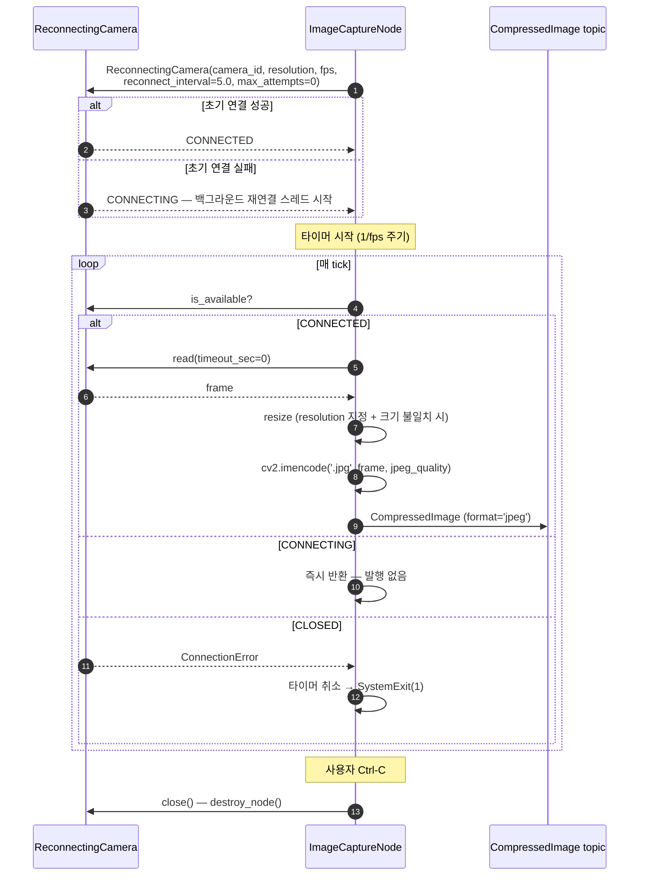
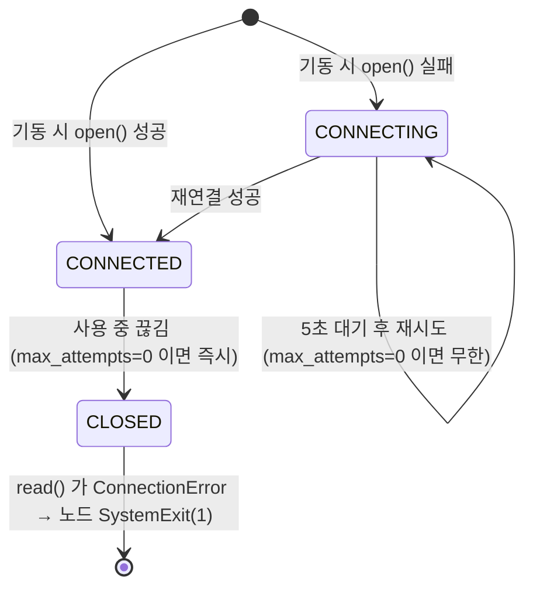

# ImageCaptureNode — Programmer's Guide

USB 카메라에서 프레임을 캡처해 **JPEG 압축 이미지(`sensor_msgs/CompressedImage`)** 로
발행하는 노드 사용 가이드.

---

## 목차

1. [개요](#1-개요)
2. [Quick Start](#2-quick-start)
3. [파라미터](#3-파라미터)
4. [토픽](#4-토픽)
5. [동작 흐름](#5-동작-흐름)
6. [재연결 동작](#6-재연결-동작)
7. [에러 처리](#7-에러-처리)
8. [트러블슈팅](#8-트러블슈팅)
9. [관련 문서](#9-관련-문서)

---

## 1. 개요

`ImageCaptureNode` 는 `ReconnectingCamera` 로 카메라를 열고, 타이머 주기마다
프레임을 읽어 `cv2.imencode('.jpg', ...)` 로 압축한 뒤 `CompressedImage` 로
발행한다. 소속 패키지는 **`robot_control`**
(`src/robot_control/robot_control/camera/image_capture.py`) 이며, 세션 상태를
구독하지 않는 순수 제어 계층 노드다.

**`CameraNode` 와의 차이:**

| 항목 | `CameraNode` | `ImageCaptureNode` |
|---|---|---|
| 발행 타입 | `Image` (+ `compress_image` 시 `CompressedImage`) + `CameraInfo` + status | `CompressedImage` 단일 |
| 카메라 래퍼 | `OpenCvCamera` (재연결 없음) | `ReconnectingCamera` (백그라운드 재연결 스레드) |
| QoS | `qos_profile_sensor_data` | BEST_EFFORT / KEEP_LAST(10) |
| 토픽명 | `~/image_raw` (private, remap 전제) | `topic` 파라미터로 지정하는 **절대 경로** |
| 용도 | 표준 카메라 파이프라인 | 대역폭이 제한된 경로로 JPEG 만 밀어 넣는 경우 |

---

## 2. Quick Start

```bash
colcon build --packages-select robot_control
source install/setup.bash

# 기본값(camera_id=0, 5fps, /stor/real/image/jpeg)으로 실행
ros2 run robot_control image_capture_node

# 파라미터 지정
ros2 run robot_control image_capture_node --ros-args \
    -p camera_id:=0 \
    -p resolution:=1280x720 \
    -p fps:=10 \
    -p topic:=/camera/image/compressed \
    -p jpeg_quality:=90

# 발행 확인
ros2 topic hz /stor/real/image/jpeg
```

---

## 3. 파라미터

| 파라미터 | 타입 | 기본값 | 설명 |
|---|---|---|---|
| `camera_id` | int \| str | `0` | 카메라 디바이스 ID 또는 영상 소스 경로 |
| `resolution` | str | None | `"WIDTHxHEIGHT"` 형식. None 이면 카메라 기본값 |
| `fps` | float | `5` | 캡처·발행 주기. 타이머 주기는 `1/fps` |
| `topic` | str | `/stor/real/image/jpeg` | 발행 토픽 이름 (절대 경로) |
| `frame_id` | str | `camera` | 메시지의 `header.frame_id` |
| `jpeg_quality` | int | `80` | JPEG 품질 0~100. 범위를 벗어나면 `ValueError` 로 기동 실패 |

`resolution` 을 지정하면 캡처한 프레임 크기가 다를 때 `cv2.resize` 로 맞춘다.

---

## 4. 토픽

| 토픽 | 타입 | QoS | 방향 |
|---|---|---|---|
| `topic` 파라미터 값 (기본 `/stor/real/image/jpeg`) | `sensor_msgs/CompressedImage` (`format='jpeg'`) | BEST_EFFORT / KEEP_LAST / depth 10 | 발행 |

구독 토픽·서비스는 없다.

---

## 5. 동작 흐름



- **발행은 `is_available` 이 `True` 일 때만** 일어난다. `CONNECTING` 구간에서는
  타이머가 계속 돌지만 아무것도 발행하지 않는다.
- **`read(timeout_sec=0)`** 이므로 연결 대기로 타이머 콜백이 막히지 않는다.
- **JPEG 인코딩은 콜백 스레드에서 동기 수행**한다. 고해상도 + 높은 fps 조합에서는
  인코딩 시간이 타이머 주기를 넘길 수 있다.

---

## 6. 재연결 동작

재연결은 `ReconnectingCamera` 가 담당하며, 노드는 상수로 고정된 값을 넘긴다
(`reconnect_interval=5.0`, `max_attempts=0`). **파라미터로 노출돼 있지 않다.**



`max_attempts=0` 의 의미가 경로에 따라 다르다는 점에 주의한다:

| 상황 | 동작 |
|---|---|
| 기동 시 카메라가 없음 | `CONNECTING` 상태로 5초 주기 **무한 재시도**. 노드는 살아 있고 발행만 하지 않는다 |
| 연결된 뒤 카메라가 빠짐 | **즉시 `CLOSED`** 로 전이. 다음 `read()` 가 `ConnectionError` → 타이머 취소 후 `SystemExit(1)` 로 노드 종료 |

즉 "처음부터 없으면 기다리고, 쓰다가 빠지면 죽는다". 두 경로가 비대칭이므로
장시간 무인 운용에는 supervisor(런치의 `respawn=True` 등)를 함께 두는 것이 좋다.

---

## 7. 에러 처리

| 상황 | 동작 |
|---|---|
| `jpeg_quality` 범위 초과 | ERROR 로그 + `ValueError` 로 기동 실패 |
| `read()` 가 None (일시적 실패) | ERROR 로그 (5초 throttle) 후 다음 주기 대기 |
| 카메라 CLOSED (`ConnectionError`) | 타이머 취소 + ERROR 로그 + `SystemExit(1)` |
| JPEG 인코딩 실패 | ERROR 로그 (5초 throttle) 후 다음 주기 대기 |
| 기타 예외 | ERROR 로그 후 계속 동작 |
| SIGINT / SIGTERM | `destroy_node()` → `camera.close()` → `rclpy.try_shutdown()` (traceback 없이 종료) |

---

## 8. 트러블슈팅

**1. 노드는 떠 있는데 토픽이 비어 있다**

```bash
# 로그에 'Initial connection failed. Starting reconnect loop.' 가 있는지 확인
ls -l /dev/video*      # 디바이스 존재 여부
```
카메라를 못 연 채 재연결 루프를 도는 중이다. `camera_id` 를 확인한다.

**2. 구독자가 메시지를 못 받는다**

발행 QoS 가 **BEST_EFFORT** 다. RELIABLE 구독자와는 매칭되지 않는다.

```bash
ros2 topic echo --qos-reliability best_effort /stor/real/image/jpeg --field format
```

**3. 사용 중 카메라를 뽑았더니 노드가 죽었다**

의도된 동작이다 — 위 [재연결 동작](#6-재연결-동작) 참고.

---

## 9. 관련 문서

- [CameraNode Guide](camera_node_guide.md) — 표준 카메라 노드 (`Image` + `CameraInfo` + status)
- [OpenCvCamera Guide](opencv_camera_guide.md) — `ReconnectingCamera` 가 감싸는 하위 래퍼
- [ImageViewerNode Guide](image_viewer_node_guide.md) — 이미지 토픽 뷰어
