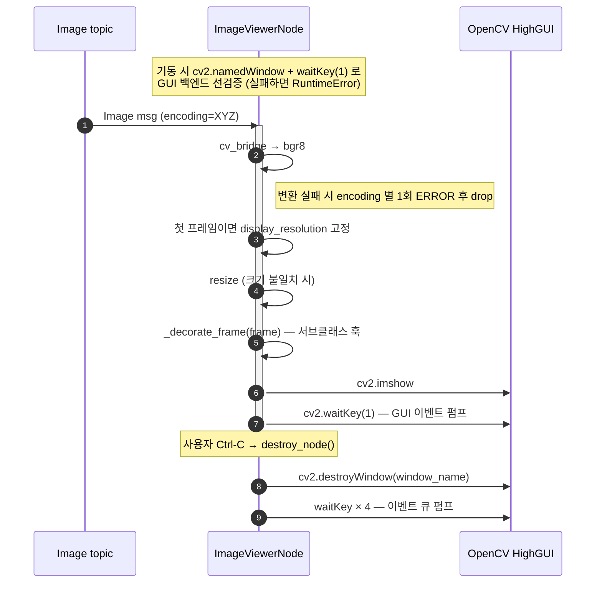

# ImageViewerNode — Programmer's Guide

ROS2 이미지 토픽을 OpenCV 윈도우에 표시하는 단순 뷰어 노드 사용 가이드.

---

## 목차

1. [개요](#1-개요)
2. [사전 요구사항](#2-사전-요구사항)
3. [Quick Start](#3-quick-start)
4. [파라미터](#4-파라미터)
5. [토픽 연결](#5-토픽-연결)
6. [동작 흐름](#6-동작-흐름)
7. [에러 처리](#7-에러-처리)
8. [실전 예제](#8-실전-예제)
9. [개발자 확장](#9-개발자-확장)
10. [트러블슈팅](#10-트러블슈팅)
11. [관련 문서](#11-관련-문서)

---

## 1. 개요

`ImageViewerNode`는 ROS2 이미지 토픽을 구독하여 OpenCV 윈도우(`cv2.imshow`)로
표시하는 단순 뷰어 노드다. 디버깅/미리보기 용도에 최적화되어 있으며, 세션
제어나 타이머 기반 출력 같은 부가 기능은 없다. 서브클래스 확장을 위한
`_decorate_frame` 훅을 제공하여 오버레이 추가 등이 용이하다.

**`RdfpImageViewerNode`와의 관계:**

`RdfpImageViewerNode`는 이 클래스를 **상속**하여 세션 토픽
(`rdfp_msgs/msg/SessionCommand`) 상태를 프레임 좌상단에 오버레이한다. 이미지
구독·표시·해상도 처리·GUI 방어 로직은 이 클래스 그대로이며, `_decorate_frame`
훅 오버라이드와 세션 구독만 추가된다. 자세한 내용은 이 가이드의 [개발자
확장](#9-개발자-확장) 절과 `RdfpImageViewerNode` 가이드 참조.

**핵심 특징:**
- `cv_bridge`로 `bgr8`/`rgb8`/`mono8` 등 일반 인코딩을 bgr8 로 자동 변환
- 기동 시 GUI 백엔드 동작 여부를 선(先)검증하여 headless 환경에서 fail-fast
- 런타임 `cv2.error`를 rate-limited 경고로 흡수해 노드 crash 방지
- 인코딩 변환 실패는 **인코딩당 1회**만 ERROR 로그 (30fps 로그 폭주 방지)
- 서브클래스가 프레임을 가공할 수 있는 `_decorate_frame` 확장 훅 제공

---

## 2. 사전 요구사항

```bash
# cv_bridge + OpenCV
sudo apt install ros-humble-cv-bridge python3-opencv

# rdfp 빌드
colcon build --packages-select rdfp
source install/setup.bash
```

X/Wayland 세션이 있어야 한다. SSH 접속 시 `DISPLAY` 환경 변수 설정 또는
`ssh -X` 가 필요하다.

---

## 3. Quick Start

```bash
# 터미널 1: 카메라 노드 (예시)
ros2 run robot_control camera_node --ros-args \
  -p camera_id:=0 -p fps:=30 -p resolution:=640x480

# 터미널 2: 뷰어 노드
ros2 run robot_control image_viewer_node --ros-args -r image:=/camera_node/image_raw
```

`image` 기본 토픽을 실제 퍼블리셔 토픽(`/camera_node/image_raw` 등)으로 remap 한다.

---

## 4. 파라미터

### 선택 파라미터

| 파라미터 | 타입 | 기본값 | 설명 |
|---|---|---|---|
| `resolution` | string | (없음) | `"WIDTHxHEIGHT"` 형식. 표시할 윈도우 크기. 미지정 시 첫 수신 이미지 크기 사용 |

### `resolution` 동작 방식

- **미지정**: 첫 수신 프레임의 크기를 표시 해상도로 고정하고 INFO 로그 남김.
  이후 publisher가 해상도를 바꿔도 첫 크기 유지 (다르면 resize).
- **지정**: 모든 입력을 해당 크기로 `cv2.INTER_AREA` 보간으로 resize.
- 윈도우는 `WINDOW_AUTOSIZE`로 생성되어 프레임 크기에 따라 자동 조절된다.

---

## 5. 토픽 연결

### 구독 토픽

| 토픽 | 타입 | QoS | 연결 방법 |
|------|------|-----|-----------|
| `image` | `sensor_msgs/Image` | `sensor_data` (BEST_EFFORT, KEEP_LAST 5) | `-r image:=/<publisher_topic>` |

이 노드는 이미지 토픽 하나만 구독하며, 서비스·퍼블리셔는 제공하지 않는다.

> ⚠️ **`sensor_msgs/CompressedImage` 는 받지 못한다 — 그리고 그것이 조용하다.**
> ROS 2 는 타입이 다르면 **연결만 하지 않고 오류를 내지 않으므로** 증상이 "빈 창"뿐이다.
> 압축으로 발행하는 소스(예: 펑션베이 시뮬레이터의 `/camera_image/compressed`)는 앞에
> 변환 노드를 둔다:
>
> ```bash
> ros2 run image_transport republish compressed raw \
>     --ros-args -r in/compressed:=/camera_image/compressed -r out:=/camera_image
> ```
>
> **remap 대상은 `in/compressed` 다 — `in` 만 remap 하면 한 장도 받지 못한다** (구독
> 플러그인이 base 토픽에 transport 접미사를 붙인 완성된 이름으로 구독하기 때문).
> `panda_functionbay` / `rdfp_panda_functionbay` 는 이 노드를 `enable_image_viewer` 로
> 뷰어와 함께 띄우므로 따로 실행할 필요가 없다.

### 자동 변환되는 인코딩

`cv_bridge.imgmsg_to_cv2(msg, desired_encoding='bgr8')` 으로 변환된다:

- `bgr8`, `rgb8`, `rgba8`, `bgra8`
- `mono8` → BGR 그레이스케일
- 기타 cv_bridge 가 지원하는 스칼라/다채널 인코딩

Bayer pattern·`mono16`·depth(`16UC1`/`32FC1`) 등 특수 인코딩은 보통 변환에
실패한다. 이런 경우 publisher 쪽에서 `bgr8` 로 발행하도록 조정하거나, 별도로
인코딩 처리 로직을 가진 뷰어를 구성한다.

---

## 6. 동작 흐름



- **기동 시 fail-fast**: `cv2.namedWindow` + `cv2.waitKey(1)` 로 GUI 백엔드를
  선검증. headless 환경이면 `RuntimeError` 로 즉시 종료.
- **런타임 GUI 에러 방어**: `cv2.imshow`/`waitKey`/`resize` 호출을
  `try/except cv2.error`로 감싸 노드 crash 방지. 실패는 5초 throttle WARNING.
- **서브클래스 훅**: 프레임은 `cv2.imshow` 직전 `_decorate_frame()` 을 통과한다
  (기본 구현은 pass-through). 오버레이·마킹 등은 이 훅에서 수행한다.
- **종료 시 GUI 정리**: Qt/GTK 백엔드는 `destroyWindow` 만으로 창이 닫히지
  않을 수 있어 `waitKey`를 수회 호출해 이벤트 큐를 펌프한다. 동일 프로세스 내
  다른 OpenCV 윈도우에는 영향을 주지 않기 위해 `destroyAllWindows()` 는
  호출하지 않는다.

---

## 7. 에러 처리

| 상황 | 동작 |
|------|------|
| GUI 백엔드 초기화 실패 (기동 시) | `RuntimeError` → `[FATAL]` → 노드 즉시 종료 |
| 지원하지 않는 encoding | `CvBridgeError` → encoding별 ERROR 1회 + 이후 drop |
| 런타임 `cv2.error` (imshow/waitKey/resize) | WARNING (5초 throttle) + 프레임 drop |
| `destroyWindow` 시 `cv2.error` | 조용히 무시 |
| SIGINT/SIGTERM, `ExternalShutdownException` | 큐 없음 → 윈도우 정리 → `rclpy.try_shutdown()` |

---

## 8. 실전 예제

### 기본 사용 (카메라 미리보기)

```bash
ros2 run robot_control image_viewer_node --ros-args -r image:=/camera_node/image_raw
```

### 고정 해상도로 표시

```bash
ros2 run robot_control image_viewer_node --ros-args \
  -r image:=/camera/image_raw \
  -p resolution:=800x600
```

### Launch 파일

```python
from launch import LaunchDescription
from launch_ros.actions import Node


def generate_launch_description():
    return LaunchDescription([
        Node(
            package='robot_control',
            executable='camera_node',
            parameters=[{
                'camera_id': '0',
                'fps': 30.0,
                'resolution': '640x480',
            }],
        ),
        Node(
            package='robot_control',
            executable='image_viewer_node',
            parameters=[{
                'resolution': '800x600',
            }],
            remappings=[
                ('image', '/camera_node/image_raw'),
            ],
        ),
    ])
```

### 여러 토픽 동시 미리보기

**프로세스를 나누어** 인스턴스당 별개의 OS 프로세스로 실행하는 것을 권장한다.

```bash
ros2 run robot_control image_viewer_node --ros-args \
  -r image:=/camera/image_raw \
  -r __node:=viewer_cam0 &

ros2 run robot_control image_viewer_node --ros-args \
  -r image:=/recorder/preview \
  -r __node:=viewer_recorder &
```

> ⚠️ OpenCV 윈도우 이름은 내부 상수(`image_viewer`) 로 고정되어 있어 CLI 에서
> 변경할 수 없다. **같은 프로세스 안**에서 여러 인스턴스를 생성하면 같은
> 윈도우를 공유해 화면이 덮어써지므로, 반드시 프로세스를 분리하거나 Python
> API 로 `ImageViewerNode(window_name='...')` 를 전달해 구분해야 한다
> (서브클래스도 생성자 인자로 고유 윈도우명을 넘길 수 있다).

---

## 9. 개발자 확장

이 클래스는 상속을 통한 기능 확장을 공식적으로 지원한다.

### 생성자 인자

| 인자 | 타입 | 기본값 | 용도 |
|---|---|---|---|
| `node_name` | `str` | `'image_viewer_node'` | ROS2 노드 이름 |
| `window_name` | `str` | `'image_viewer'` | OpenCV 윈도우 이름 |
| `**node_kwargs` | — | — | `rclpy.node.Node.__init__` 전달 (테스트에서 `parameter_overrides` 등) |

서브클래스는 `super().__init__(node_name='...', window_name='...')` 형태로
이름을 재정의한다.

### `_decorate_frame(frame)` 훅

`cv2.imshow` 직전에 호출되는 확장 포인트다. 기본 구현은 프레임을 그대로
반환하며, 서브클래스는 텍스트 오버레이·도형·마스킹 등 추가 렌더링 결과를
반환하면 된다.

```python
def _decorate_frame(self, frame: np.ndarray) -> np.ndarray:
    # frame: np.ndarray (BGR, uint8), resize 가 적용된 상태
    overlay = frame.copy()         # 원본 보존을 원하면 copy 권장
    cv2.putText(overlay, 'HELLO', (10, 30),
                cv2.FONT_HERSHEY_SIMPLEX, 0.7, (255, 255, 255), 2)
    return overlay
```

구현 가이드라인:
- **예외는 훅 안에서 흡수**한다. 부모 `_on_image` 는 `cv2.error` 만 rate-limit
  로그로 방어하므로, 훅에서 예상치 못한 예외가 전파되면 콜백 전체가 실패해
  다음 프레임도 영향을 받을 수 있다. 실패 시 원본 프레임 반환이 권장 패턴이다.
- **성능**: 프레임당 매번 호출되므로 연산을 가볍게 유지한다 (30fps 기준).
- **in-place 수정**: 허용되지만 원본을 다른 용도로 공유한다면 `frame.copy()`
  로 복사한 뒤 수정하는 편이 안전하다.

### 서브클래스 스켈레톤

```python
from robot_control.camera.image_viewer_node import ImageViewerNode

class MyViewerNode(ImageViewerNode):
    def __init__(self, **node_kwargs):
        super().__init__(
            node_name='my_viewer_node',
            window_name='my_viewer',
            **node_kwargs,
        )
        # 추가 구독/퍼블리셔/상태 초기화

    def _decorate_frame(self, frame):
        # 프레임 가공 후 반환
        return frame
```

참고 구현: [`RdfpImageViewerNode`](../../src/rdfp/rdfp/camera/rdfp_image_viewer_node.py) —
세션 상태 구독 + 오버레이 예시.

---

## 10. 트러블슈팅

### 1. 윈도우가 뜨지 않음

**원인 1**: `DISPLAY` 미설정 또는 X/Wayland 연결 불가 (SSH headless 등).

```
[FATAL] ImageViewerNode init failed: OpenCV GUI backend is not available
        (headless environment or missing display): ...
```

→ GUI 세션에서 실행하거나 `ssh -X` 로 재접속한다.

**원인 2**: 입력 토픽에 publisher 가 없음.

```bash
ros2 topic info -v /camera_node/image_raw   # Publisher count: 0 이면 미연결
```

→ 퍼블리셔가 실행 중인지, remap 경로가 올바른지 확인한다.

### 2. 이미지가 이상한 색으로 표시됨

**원인**: publisher 가 사용하는 인코딩이 `cv_bridge` 자동 변환과 맞지 않음.

```bash
ros2 topic echo /camera_node/image_raw --field encoding --once
```

→ `bgr8`/`rgb8`/`mono8` 등 일반 인코딩이 아니면 `RdfpImageViewerNode` 사용을
고려하거나 publisher 쪽에서 `bgr8` 로 발행하도록 조정한다.

### 3. `cv_bridge conversion failed (encoding=...)` 로그가 한 번 뜨고 아무 이미지도 안 보임

**원인**: 해당 인코딩은 자동 변환 대상이 아니며, 이후 프레임은 encoding별
로그 중복 방지를 위해 조용히 drop 된다.

→ publisher 인코딩을 확인하고 `bgr8` / `rgb8` / `mono8` 중 하나로 바꾸거나
`RdfpImageViewerNode`로 전환한다.

### 4. 첫 프레임 이후 `resolution` 이 바뀌지 않음

**의도된 동작이다.** 첫 수신 프레임 크기를 고정해 중간에 publisher 해상도가
바뀌어도 표시 크기를 유지한다. 런타임 변경을 원하면 노드를 재시작한다.

### 5. 로그에 `OpenCV HighGUI failure` 가 반복됨

**원인**: 실행 중 X/Wayland 연결 단절 또는 리모트 세션 disconnect.

`WARN`은 5초에 1회로 rate-limit 되며 노드는 crash 하지 않는다. 디스플레이
세션을 복구하거나 노드를 재시작한다.

### 6. Ctrl-C 후 윈도우가 남음

일부 OpenCV 빌드/백엔드에서 드물게 발생할 수 있다. `destroy_node()` 는 자신이
생성한 윈도우만 `cv2.destroyWindow(self._window_name)` + `waitKey × 4` 로
정리하므로 대부분 해소된다 (다른 뷰어에 영향을 주지 않기 위해
`destroyAllWindows()` 는 의도적으로 호출하지 않는다). 그래도 잔존하면 창
관리자(window manager) 문제로 의심한다.

---

## 11. 관련 문서

- [CameraNode Guide](./opencv_camera_guide.md) — 이미지 토픽 발행자
- [RdfpCameraNode Guide](./rdfp_camera_node_guide.md) — 세션 연동 카메라 노드
- [OpenCvCamera Guide](./opencv_camera_guide.md) — 내부 카메라 래퍼
