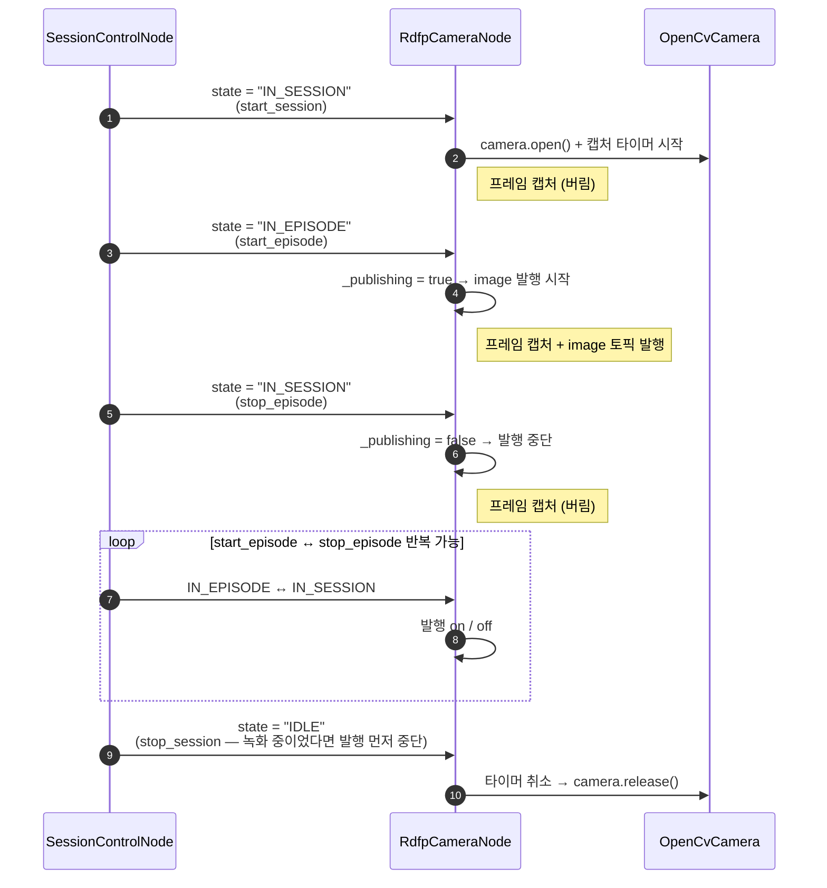

# RdfpCameraNode — Programmer's Guide

세션 상태에 따라 카메라를 열고/닫고, `IN_EPISODE` 구간에서만 이미지를 발행하는 노드 사용 가이드.

---

## 목차

1. [개요](#1-개요)
2. [사전 요구사항](#2-사전-요구사항)
3. [Quick Start](#3-quick-start)
4. [파라미터](#4-파라미터)
5. [세션 상태별 동작](#5-세션-상태별-동작)
6. [토픽 연결](#6-토픽-연결)
7. [에러 처리](#7-에러-처리)
8. [실전 예제](#8-실전-예제)
9. [트러블슈팅](#9-트러블슈팅)
10. [관련 문서](#10-관련-문서)

---

## 1. 개요

`RdfpCameraNode`는 `SessionControlNode`가 발행하는 세션 토픽의 상태 변경에
따라 `OpenCvCamera`를 제어하고, `IN_EPISODE` 구간에서만 `sensor_msgs/Image`를
`~/image_raw` private 토픽(기본 resolve 결과 `/rdfp_camera_node/image_raw`)으로
발행한다.

> 소속 패키지는 **`rdfp`** 다 (`src/rdfp/rdfp/camera/rdfp_camera_node.py`).
> `/session` 상태에 종속되는 수집 계층 노드이므로 제어 계층(`robot_control`)이
> 아니라 여기에 둔다. 카메라 하드웨어 추상화(`OpenCvCamera`)만 `robot_control`
> 것을 그대로 쓴다.

**기존 `CameraNode`과의 차이:**

| 항목 | `CameraNode` | `RdfpCameraNode` |
|---|---|---|
| 카메라 열기 | 노드 시작 시 즉시 | 세션 시작(`IN_SESSION`) 시 |
| 이미지 발행 | 항상 | `IN_EPISODE` 구간에서만 |
| 세션 연동 | 없음 | `session` 토픽 구독 |
| 병존 여부 | 독립 | 독립 (양쪽 동시 실행 가능) |

**핵심 특징:**
- `IN_SESSION` 구간에서는 캡처만 수행하고 프레임을 버림 (카메라 warm-up)
- `IN_EPISODE` 전이 시 즉시 이미지 발행 시작
- 카메라 open 실패 시 IDLE 전이까지 모든 명령을 무시하여 안전하게 동작
- 캡처 중 연결이 끊기면 캡처 타이머를 멈추고 `reconnect_interval_sec` 주기로
  재연결을 시도한다. 성공하면 세션 상태를 유지한 채 발행이 재개된다
- `camera_status` 는 **상태가 바뀔 때만** 발행한다 (끊긴 카메라에서 초당 fps 회
  쏟아지지 않는다). 노드 시작 시 `DISCONNECTED` 를 한 번 latch 해 둔다

---

## 2. 사전 요구사항

```bash
# rdfp_msgs + rdfp 빌드
colcon build --packages-select rdfp_msgs robot_control robot_twin rdfp
source install/setup.bash
```

`SessionControlNode`가 실행 중이어야 세션 토픽이 발행된다.

---

## 3. Quick Start

```bash
# 터미널 1: 세션 제어 노드
ros2 run rdfp session_control_node

# 터미널 2: 카메라 노드
ros2 run rdfp rdfp_camera_node --ros-args \
  -r session:=/session_control/session \
  -p camera_id:=0

# 터미널 3: 세션 제어
ros2 service call /session_control/start_session std_srvs/srv/Trigger
ros2 service call /session_control/start_episode std_srvs/srv/Trigger
# ... 이미지 발행 중 ...
ros2 service call /session_control/stop_episode std_srvs/srv/Trigger
ros2 service call /session_control/stop_session std_srvs/srv/Trigger

# 이미지 토픽 확인
ros2 topic hz /rdfp_camera_node/image_raw
```

`start_session` → 카메라 열림, `start_episode` → 이미지 발행 시작,
`stop_episode` → 발행 중단, `stop_session` → 카메라 닫힘.

---

## 4. 파라미터

| 파라미터 | 타입 | 기본값 | 설명 |
|----------|------|--------|------|
| `camera_id` | int \| str | `"0"` | 카메라 디바이스 ID 또는 영상 소스 경로. 필수 |
| `fps` | float | None | 캡처 FPS. None이면 카메라 기본값 사용 |
| `resolution` | str | None | `"WIDTHxHEIGHT"` 형식. None이면 카메라 기본값 사용 |
| `encoding` | str | `"bgr8"` | `cv_bridge` 이미지 변환 시 encoding (`bgr8`/`rgb8`/`mono8`) |
| `frame_id` | str | `"camera_link"` | Image 메시지의 `header.frame_id` |
| `reconnect_interval_sec` | float | `3.0` | 연결이 끊기거나 open 에 실패했을 때 재시도 주기(초). `0` 이하이면 재연결하지 않음 |

`fps`와 `resolution`을 생략하면 카메라 기본 설정을 사용한다.
실제 적용된 값은 `IN_SESSION` 전이 시 로그에 출력된다.

---

## 5. 세션 상태별 동작



### 상태 전이 요약

| 전이 | 동작 |
|------|------|
| → `IDLE` | 타이머 취소, `camera.release()`, 플래그 리셋 |
| `IDLE` → `IN_SESSION` | `camera.open()`, 캡처 타이머 생성 (프레임 버림) |
| `IN_SESSION` → `IN_EPISODE` | 이미지 발행 시작 |
| `IN_EPISODE` → `IN_SESSION` | 이미지 발행 중단, 캡처는 계속 |
| `IN_SESSION` → `IDLE` | 타이머 취소, `camera.release()` |

---

## 6. 토픽 연결

### 구독 토픽

| 토픽 | 타입 | QoS | 연결 방법 |
|------|------|-----|-----------|
| `session` | `rdfp_msgs/SessionCommand` | RELIABLE / TRANSIENT_LOCAL / depth=1 | `-r session:=/session_control/session` |

### 발행 토픽

토픽은 모두 **private namespace(`~/`)** 로 선언되어 있어 노드 이름이
자동으로 prepend 된다. 기본 노드 이름 `rdfp_camera_node` 기준 resolve
결과는 아래 "기본 경로" 열에 표기한다.

| 토픽(선언) | 기본 경로 | 타입 | QoS |
|---|---|---|---|
| `~/image_raw` | `/rdfp_camera_node/image_raw` | `sensor_msgs/Image` | `qos_profile_sensor_data` (BEST_EFFORT / VOLATILE) |
| `~/camera_info` | `/rdfp_camera_node/camera_info` | `sensor_msgs/CameraInfo` | `qos_profile_sensor_data` |
| `~/camera_status` | `/rdfp_camera_node/camera_status` | `std_msgs/String` | `SYSTEM_QOS` (RELIABLE / TRANSIENT_LOCAL) |

`~/image_raw` 토픽은 `IN_EPISODE` 구간에서만 발행된다.
`RdfpImageRecorder`와 연동하려면 양쪽 노드의 이미지 토픽을 동일 이름으로
remap 한다 (예: `-r ~/image_raw:=/rdfp/image_raw`).

### 서비스

이 노드는 서비스를 제공하지 않는다. 카메라 제어는 세션 토픽 구독으로 자동 수행된다.

---

## 7. 에러 처리

| 상황 | 동작 |
|------|------|
| `camera.open()` 실패 (`RuntimeError`) | ERROR 로그 + `ERROR` status + `_open_failed=True`. 이후 `IN_EPISODE` 무시. 재연결 타이머가 걸리고, `IDLE` 전이 시 리셋 |
| `camera.read()` 실패 (None 반환, 연결은 유지) | WARNING (5초 throttle). 다음 타이머 콜백까지 대기 |
| `camera.read()` 실패 + `is_opened == False` (연결 끊김) | 캡처 타이머 정지 + `release()` + `DISCONNECTED` status. `reconnect_interval_sec` 주기로 재연결 시도 (`_publishing` 은 유지) |
| 알 수 없는 session state | WARNING 로그. `_prev_state` 변경하지 않음 |
| SIGINT / SIGTERM | `destroy_node()` → 타이머 취소 → `camera.release()` |

---

## 8. 실전 예제

### 기본 사용

```bash
ros2 run rdfp rdfp_camera_node --ros-args \
  -r session:=/session_control/session \
  -p camera_id:=0 \
  -p fps:=30.0 \
  -p resolution:=640x480
```

### RdfpImageRecorder와 연동

```bash
# 카메라 노드
ros2 run rdfp rdfp_camera_node --ros-args \
  -r session:=/session_control/session \
  -r ~/image_raw:=/rdfp/image_raw \
  -p camera_id:=0 \
  -p fps:=30.0 \
  -p resolution:=640x480

# 레코더 노드
ros2 run rdfp rdfp_image_recorder --ros-args \
  -r image:=/rdfp/image_raw \
  -r session:=/session_control/session \
  -p output_dir:=/tmp/recordings \
  -p fps:=30 \
  -p resolution:=640x480
```

### Launch 파일

```python
from launch import LaunchDescription
from launch_ros.actions import Node


def generate_launch_description():
    return LaunchDescription([
        Node(
            package='rdfp',
            executable='session_control_node',
        ),
        Node(
            package='rdfp',
            executable='rdfp_camera_node',
            parameters=[{
                'camera_id': '0',
                'fps': 30.0,
                'resolution': '640x480',
                'encoding': 'bgr8',
                'frame_id': 'camera_link',
            }],
            remappings=[
                ('session', '/session_control/session'),
                ('~/image_raw', '/rdfp/image_raw'),
            ],
        ),
        Node(
            package='rdfp',
            executable='rdfp_image_recorder',
            parameters=[{
                'output_dir': '/tmp/recordings',
                'fps': 30,
                'resolution': '640x480',
            }],
            remappings=[
                ('image', '/rdfp/image_raw'),
                ('session', '/session_control/session'),
            ],
        ),
    ])
```

---

## 9. 트러블슈팅

### 1. 카메라가 열리지 않음

**확인:**
```bash
# 세션 토픽이 발행되는지 확인
ros2 topic echo /session_control/session \
  --qos-durability transient_local --qos-reliability reliable

# 카메라 디바이스 존재 여부
ls -la /dev/video*
```

- `IN_SESSION` 상태가 도착해야 카메라가 열린다
- `camera open failed` 에러가 출력되면 `camera_id`와 디바이스 연결을 확인

### 2. 이미지가 발행되지 않음

**확인:**
```bash
ros2 topic hz /rdfp/image_raw
```

- `IN_EPISODE` 상태가 도착해야 이미지가 발행된다
- 카메라 open이 실패한 상태(`_open_failed`)이면 `IN_EPISODE`가 무시된다.
  로그에서 `camera open had failed` 메시지를 확인
- remap이 올바르게 설정되었는지 확인

### 3. 프레임 캡처 실패 경고

```
[WARN] frame read failed (camera_id=0)
```

**원인**: 카메라 연결이 끊겼거나 디바이스가 다른 프로세스에 점유됨.

**해결:**
- USB 카메라: 케이블 연결 확인 후 세션을 `IDLE` → `IN_SESSION`으로 재시작
- 네트워크 카메라: 스트림 URL과 네트워크 상태 확인

### 4. 요청한 FPS/해상도와 실제 값이 다름

```
[WARN] Requested resolution ... differs from actual resolution ...
```

카메라가 요청한 값을 정확히 지원하지 않으면 가장 가까운 값으로 자동 조정된다.
실제 적용된 값은 `session IN_SESSION: camera opened` 로그에서 확인할 수 있다.

---

## 10. 관련 문서

- [RdfpImageRecorder Guide](../recorder/rdfp_image_recorder_node_guide.md) — 이미지 녹화 노드
- [SessionControlNode Guide](../../docs/session/session_control_guide.md) — 세션 제어 노드
