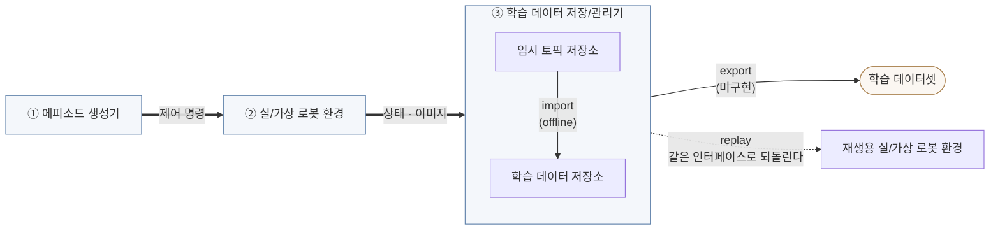
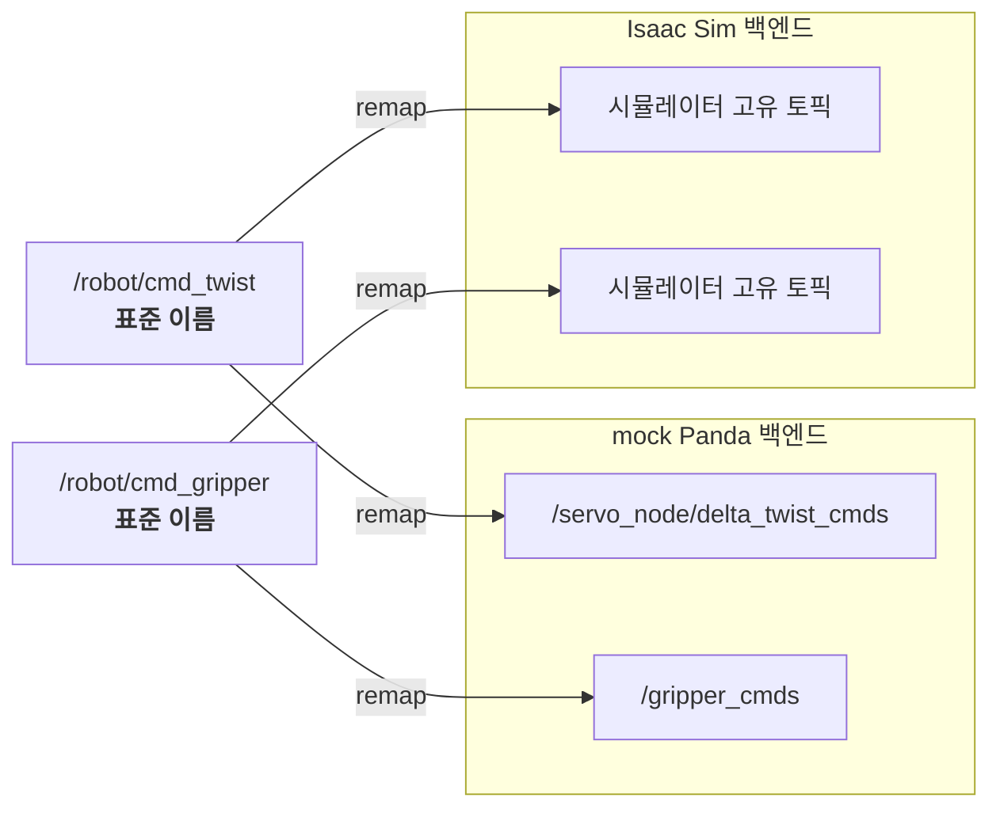
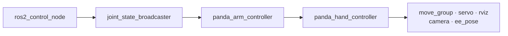
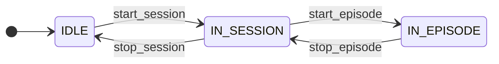
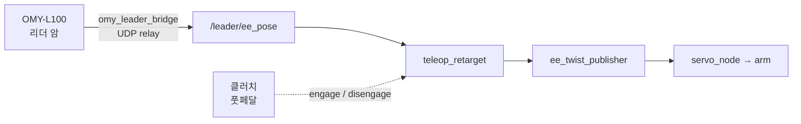
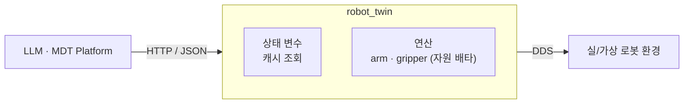
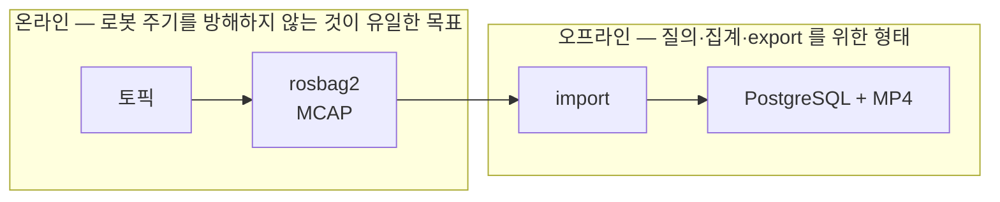
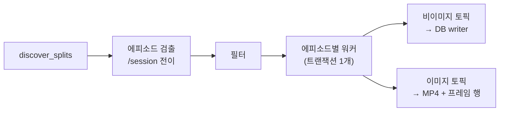
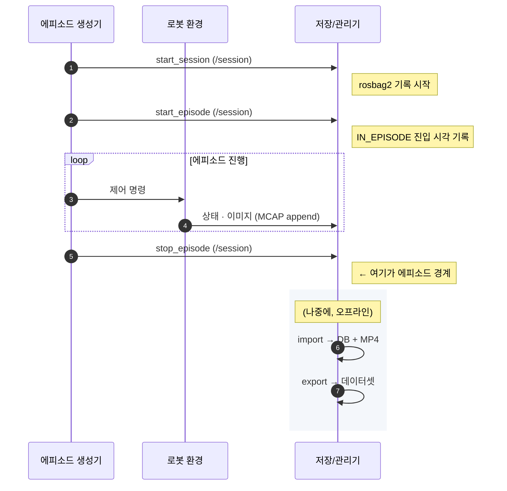

# rdfp 프레임워크 — 전체 구조와 설계

> **이 문서의 위치** — `rdfp_ws` 전체를 조망하는 **최상위 문서**다. 개별 노드·CLI 의
> 사용법은 [INDEX.md](INDEX.md) 가 가리키는 각 문서에 있고, 여기서는 **왜 이렇게
> 나뉘어 있는지**와 **서브시스템 사이의 계약**을 다룬다.
>
> **상태 표기** — 절마다 `현행`(코드와 일치) / `설계안`(코드 미반영) 을 표시한다.

---

## 목차

- [1. 목적과 범위](#1-목적과-범위)
- [2. 서브시스템 경계와 표준 인터페이스](#2-서브시스템-경계와-표준-인터페이스)
- [3. 서브시스템 1 — 실/가상 로봇 환경](#3-서브시스템-1--실가상-로봇-환경)
- [4. 서브시스템 2 — 에피소드 생성기](#4-서브시스템-2--에피소드-생성기)
- [5. 서브시스템 3 — 학습 데이터 저장/관리기](#5-서브시스템-3--학습-데이터-저장관리기)
- [6. 에피소드 생명주기](#6-에피소드-생명주기)
- [7. 패키징 — ROS 워크스페이스에 전부 두는 것이 맞는가](#7-패키징--ros-워크스페이스에-전부-두는-것이-맞는가)
- [8. 현재 상태 요약](#8-현재-상태-요약)
- [9. 미결 항목](#9-미결-항목)

---

## 1. 목적과 범위

### 1.1 무엇을 만드는가

**imitation learning 용 로봇 학습 데이터를 생성·저장·관리하는 프레임워크**다. 사람이
로봇을 조작한 궤적을 에피소드 단위로 수집해, 학습에 바로 쓸 수 있는 데이터셋으로
내보내는 것이 최종 산출물이다.

로봇 제어 자체가 목적이 아니다. 제어는 **데이터를 만들기 위한 수단**이며, 그래서 이
프레임워크의 모든 설계 결정은 "그 데이터가 나중에 학습에 쓸 만한가"를 기준으로 판단한다.

### 1.2 세 서브시스템



세 서브시스템은 **각각 통째로 교체 가능**해야 한다. mock Panda 를 Isaac Sim 으로,
키보드를 리더 암으로, PostgreSQL 을 다른 저장소로 바꿔도 나머지가 그대로 동작하는 것이
목표다.

그래서 위 그림에는 **구조만 두고 구현물 이름을 넣지 않았다.** 지금 붙어 있는 것들은
아래와 같으며, 이 목록은 **고정된 것이 아니라 예시**다.

| 서브시스템 | 현재 구현 예 |
|---|---|
| ① 에피소드 생성기 | 키보드 teleop · leader-follower(OMY-L100) · LLM(robot twin) · 글로브 |
| ② 실/가상 로봇 환경 | Franka Panda(실기 · mock) · Gazebo · Isaac Sim · RViz · 펑션베이 |
| ③ 학습 데이터 저장/관리기 | 임시 토픽 저장소 = rosbag2(MCAP), 학습 데이터 저장소 = PostgreSQL + MP4 |
| 학습 데이터셋 | LeRobot v3 · ALOHA |

③ 안의 두 상자만 그림에 남긴 이유는 그것이 구현 선택이 아니라 **구조 그 자체**이기
때문이다 — 수집 경로와 질의 경로를 나누는 것이 이 서브시스템의 설계 핵심이다 (5.1).

### 1.3 설계 원칙

| 원칙 | 의미 |
|---|---|
| **인터페이스가 계약이다** | 서브시스템은 구현이 아니라 토픽·타입·QoS 규약으로 서로를 안다 |
| **에피소드 경계는 하나의 출처에서** | `/session` 토픽이 유일한 시작·끝 신호다. 각자 판단하지 않는다 |
| **수집 경로에 DB 를 두지 않는다** | 로봇이 도는 동안에는 MCAP 에만 쓴다 (5.1) |
| **재생은 수집의 역함수다** | 저장된 것을 같은 인터페이스로 되돌릴 수 있어야 데이터가 검증된다 |
| **교체 가능성은 이름에서 시작한다** | 토픽 이름에 구현이 드러나면 교체할 수 없다 (2.3 — **현재 어긋나 있다**) |

---

## 2. 서브시스템 경계와 표준 인터페이스

### 2.1 인터페이스 계약 `현행`

로봇 환경이 노출하는 토픽이 곧 세 서브시스템의 공통 언어다.

| 방향 | 역할 | 현재 토픽 | 타입 |
|:-:|---|---|---|
| **입력** | 팔 제어 (속도) | `/servo_node/delta_twist_cmds` | `geometry_msgs/TwistStamped` |
| 입력 | 팔 제어 (관절 위치) | `/target_joint_cmds` | `sensor_msgs/JointState` |
| 입력 | 그리퍼 제어 | `/gripper_cmds` | `rdfp_msgs/GripperCommand` (`goal` — 심볼) |
| **출력** | 팔·그리퍼 관절 상태 | `/joint_states` | `sensor_msgs/JointState` |
| 출력 | 엔드이펙터 자세 | `/ee_pose` | `geometry_msgs/PoseStamped` |
| 출력 | 그리퍼 상태 | `/gripper_states` | `rdfp_msgs/GripperState` (`width`/`stalled`/`at_goal`) |
| 출력 | 카메라 RGB | `/camera/image_raw` | `sensor_msgs/Image` |
| **제어** | 에피소드 경계 | `/session` | `rdfp_msgs/SessionCommand` (TRANSIENT_LOCAL) |

`/session` 만 성격이 다르다 — 로봇을 움직이는 명령이 아니라 **데이터 수집 구간을
선언**하는 신호이며, 에피소드 생성기와 저장기가 함께 본다.

> **`/session` 의 QoS 는 `TRANSIENT_LOCAL` 이다.** 늦게 뜬 녹화기도 현재 상태를 보게
> 하기 위한 것이며, 구독자와 `ros2 topic echo` 모두 QoS 를 맞춰야 한다.

### 2.2 action 과 observation 을 함께 남긴다 `현행`

imitation learning 데이터의 핵심은 **(관측, 행동) 쌍**이다. 그래서 같은 물리량을 두 개의
토픽으로 남긴다.

| | 토픽 | 의미 |
|---|---|---|
| action (팔) | `/target_joint_cmds` | 컨트롤러로 **나간 명령값** |
| action (그리퍼) | `/gripper_cmds` | 보낸 **의도** (심볼) |
| observation (팔) | `/joint_states` | 실제 **도달값** |
| observation (그리퍼) | `/gripper_states` | 실제 **개구 폭** + 파지 여부 |

**팔은 숫자, 그리퍼는 심볼이다 — 비대칭이 의도적이다 (2026-09-01 결정).**

원래는 그리퍼 명령도 숫자(`position`/`max_effort`)였고, 근거는 "심볼을 쓰면 그 의미가
노드 상수에 남아 데이터셋이 자기 완결적이지 않게 된다"였다. 다시 따져 보니 그 숫자가
**그리퍼에 종속**이라는 대가가 더 컸다 — `position` 은 관절값이라 ROS 표준(개구 폭)과
뜻이 달랐고, Robotiq 2F-85 처럼 관절이 각도인 기구에서는 단위조차 m 가 아니다. 다른
그리퍼로 옮기면 그 숫자는 **틀린 값**이 되지만, 심볼은 "그 그리퍼에 맞게 쥐어라"로
남아 이식된다.

**자기 완결성은 관측 쪽이 맡는다.** `/gripper_states` 가 개구 폭(m)을 주기 발행하므로
"그때 실제로 얼마나 벌어져 있었나"는 데이터 안에 있다. 명령은 "무엇을 원했는가",
관측은 "무엇이었는가" — 팔에서 `/target_joint_cmds` 와 `/joint_states` 가 나뉘는 것과
같은 구조이며, 그리퍼는 그 명령 쪽 표현이 심볼일 뿐이다.

> **왜 액션이 아니라 토픽인가** — 액션 goal 전송은 서비스라 **rosbag2(Humble)가
> 기록하지 못한다.** 명령을 토픽으로 흘리고 `GripperNode` 가 자기 백엔드 방식으로
> 실행하는 구조를 택한 이유가 이것이다.

둘 다 `sensor_msgs/JointState` 라 DB 에서는 같은 테이블에 들어가고 `topic_id` 로만
구분된다. 이 구분이 사라지면 학습 데이터로서의 가치가 크게 떨어지므로, 녹화 목록에서
두 토픽을 함께 유지한다 ([config/recording_topics.list](../config/recording_topics.list)).

### 2.3 계약은 두 겹이다 `현행 + 설계안`

경계가 하나가 아니라는 점을 구분해야 논의가 엉키지 않는다.

| 경계 | 계약 내용 | 정의된 곳 |
|---|---|---|
| **로봇 환경 ↔ MoveIt/컨트롤러** | `panda_arm_controller` / `panda_hand_controller` 액션, 관절 이름, TF 트리, `robot_description` | [simulation/multi_simulator_backend_design.md](simulation/multi_simulator_backend_design.md) §5 |
| **에피소드 생성기 ↔ 로봇 환경** | 2.1 의 토픽 표 | 이 문서 |

아래(백엔드 계약)는 **Panda 이름을 그대로 고정**하기로 이미 결정되어 있다. MoveIt 의
`moveit_controllers.yaml` 을 백엔드마다 다시 쓰지 않기 위해서다. mock / Gazebo /
Isaac Sim 을 바꾸는 데는 이것으로 충분하다 — **다만 "Panda 가 아닌 로봇"으로 가는 것은
그보다 큰 별개의 단계**라는 뜻이기도 하다.

#### 위쪽 경계의 부채 ⚠️

문제는 위쪽이다. 생성기가 쓰는 입력 토픽 이름에 **rdfp 내부 노드 이름이 드러나 있다.**

| 지금 이름 | 드러난 구현 |
|---|---|
| `/servo_node/delta_twist_cmds` | MoveIt Servo 노드 |
| ~~`/gripper_control/gripper_cmds`~~ | **해소됨 (2026-09-02)** — `/gripper_cmds` 로 노드 이름을 뗐다 |

이건 컨트롤러 이름(위 표의 아래쪽 계약)이 아니라 **중간 어댑터 노드의 이름**이다. 로봇
환경이 servo 를 쓰지 않는 방식(예: 시뮬레이터가 자체 IK 를 제공)으로 바뀌면 이름이
의미를 잃는데, 그때 생성기 세 개와 녹화 목록이 함께 움직여야 한다.

**권고** — 중립 이름을 정하고 각 환경 구현이 remap 으로 맞춘다.



지금 바꾸면 녹화 목록·DB `topics` 테이블·재생 경로가 함께 움직인다. **두 번째 로봇
환경을 실제로 붙이는 시점**에 하는 것이 비용이 가장 적으므로, 그때까지는 이 절이 부채를
기록해 둔다.

---

## 3. 서브시스템 1 — 실/가상 로봇 환경

### 3.1 역할 `현행`

제어 명령을 받아 로봇을 움직이고, 상태와 이미지를 발행한다. **에피소드가 무엇인지 모르고
데이터가 어디로 가는지도 모른다** — 그것이 이 서브시스템을 교체 가능하게 만든다.

### 3.2 현재 구현 — Franka Panda mock 스택

`ros2_control` + MoveIt2 로 구성하며, 컨트롤러 기동은 의도적으로 **순차적**이다
(`RegisterEventHandler(OnProcessExit)` 체인).



**팔 컨트롤러가 두 갈래**라는 점이 이 스택의 특징이다.

| | JTC (`panda_mock`) | JGPC (`panda_jgpc_mock`) |
|---|---|---|
| 컨트롤러 | `JointTrajectoryController` | `JointGroupPositionController` |
| 명령 토픽 | `/panda_arm_controller/joint_trajectory` | `/panda_arm_controller/commands` |
| MoveIt 실행 | 가능 | **불가** (`FollowJointTrajectory` 없음) |
| 폐루프 | 예 | **아니오** — 정상 반환이 도달을 보장하지 않는다 |

`create_move_group_client()` 가 이 차이를 흡수하므로 상위 코드는 분기하지 않는다.
자세한 것은 [moveit/MoveGroupClient_UserGuide.md](moveit/MoveGroupClient_UserGuide.md).

### 3.3 다른 환경으로 교체할 때 `설계안`

**백엔드 계약의 정본은 [simulation/multi_simulator_backend_design.md](simulation/multi_simulator_backend_design.md) §5 다** —
반드시 제공해야 하는 것(관절 상태·컨트롤러 액션·TF·`robot_description`), 보장 조건,
카메라 토픽 일원화가 거기 있다. 여기서는 **데이터 수집 관점에서만** 세 가지를 덧붙인다.

1. **stamp 를 채운다.** 저장기가 에피소드를 시각으로 자르므로 stamp 가 없으면 데이터가
   무의미해진다.
2. **주기를 유지한다.** 실효 10 Hz 미만이면 재생이 계단식이 된다.
3. **`/joint_states` 에 그리퍼 관절을 포함한다.** 팔만 있으면 파지 시점을 복원할 수 없다.

Gazebo 브링업 절차는 [simulation/gazebo_bringup_guide.md](simulation/gazebo_bringup_guide.md),
입력 어댑터 규약은 [teleop/external_input_adapters.md](teleop/external_input_adapters.md).

---

## 4. 서브시스템 2 — 에피소드 생성기

### 4.1 공통 책임 `현행`

로봇을 움직여 **의미 있는 궤적을 만들고**, 그 구간을 `/session` 으로 선언한다. 구현이
셋이지만 이 두 가지는 동일하다.



에피소드 분할은 **`IN_EPISODE → IN_SESSION` 전이**를 기준으로 한다
([session/session_control_guide.md](session/session_control_guide.md)).

### 4.2 키보드 teleop `현행`

`teleop_keyboard` 가 키 입력을 twist 로 바꿔 servo 에 직접 넣는다. 그리퍼는 `=`/`-`
키가 `/gripper_cmds` 에 심볼을 발행한다.

가장 단순하고 의존성이 없어 **다른 두 경로를 검증하는 기준선** 역할을 한다.

### 4.3 leader-follower teleop (OMY-L100) `현행`

리더 암의 자세를 팔로워에 상대 매핑한다. 관절 체계가 다른 이기종이라 **EE pose 기준
retargeting** 을 쓴다.



- 리더는 별도 저장소(`omy_leader_bridge`)이며 **ROS 2 Jazzy + zenoh** 라 런타임을
  공유하지 않는다. UDP 릴레이로 넘어온다.
- 클러치는 앵커를 다시 잡는 장치다. 데드맨으로 쓰려면 `pedal_timeout` 을 켜야 한다.
- **그리퍼 경로가 아직 없다** — 리더 트리거를 쓰는 설계는
  [teleop/leader_gripper_mapping_design.md](teleop/leader_gripper_mapping_design.md).

### 4.4 LLM 기반 제어 (robot twin) `현행 (부분)`

ROS 를 모르는 주체가 **HTTP/JSON 만으로** 로봇을 조작하게 하는 게이트웨이다. LLM 이
상태 변수를 읽고 연산을 조합해 태스크를 수행하는 것을 상정한다.



| 제공 | 내용 |
|---|---|
| 상태 변수 | `joint_states` / `ee_pose` / `gripper_state` / `scene_objects` / `named_targets` |
| 연산 (arm) | `move_to_named_target` / `move_to_joints` / `move_linear` |
| 연산 (gripper) | `move_gripper_to_target` (`open`/`close`/`grasp`) |
| 안전 | 자원 배타 락, E-stop, 세션 수명주기 |

**주변 물체의 위치 정보는 아직 없다.** pick-and-place 를 LLM 이 수행하려면 "캔이 어디
있는가"가 필요한데, 현재 트윈은 로봇 자신의 상태만 노출한다 — 9장의 미결 항목이다.

상세는 [robot_twin/robot_twin_user_guide.md](robot_twin/robot_twin_user_guide.md).

### 4.5 세 구현 비교

| | 키보드 | leader-follower | LLM (twin) |
|---|:-:|:-:|:-:|
| 제어 입력 | twist 직결 | pose → retarget | 연산 호출 |
| 궤적 품질 | 거칠다 | **사람 손 그대로** | 계획된 매끄러움 |
| 그리퍼 | 키 | 미연동 | 연산 |
| 자동화 | 불가 | 불가 | **가능** |
| 주 용도 | 검증·디버깅 | **학습 데이터 수집** | 태스크 자동 반복 |

---

## 5. 서브시스템 3 — 학습 데이터 저장/관리기

### 5.1 왜 2단 저장인가 `현행`

로봇이 도는 동안과 학습 데이터를 만드는 시점을 **분리**한다.



DB 를 수집 경로에 두지 않는 이유는 **부하와 실패 전파** 때문이다. DB 가 느려지거나 죽으면
그 영향이 로봇 제어 주기까지 올라온다. MCAP 은 append-only 라 그 위험이 없다.

대가로 **import 라는 단계가 하나 늘고**, 그 사이에는 데이터가 질의 불가능한 상태로 있다.

### 5.2 온라인 — 무엇을 녹화하는가 `현행`

녹화 대상은 [config/recording_topics.list](../config/recording_topics.list) **한 곳이
단일 출처**이며, `record_rosbag.sh` 와 `dataset_config.yaml` 이 함께 읽는다.

> **rosbag2 세션에 `metadata.yaml` 이 없으면 조용히 건너뛴다 ⚠️**
> SIGKILL 로 죽거나 크래시하면 `import` 가 **성공적으로 종료하면서 빈 요약**을 낸다.
> `ros2 bag reindex -s mcap <session_dir>` 으로 복구한다.

### 5.3 오프라인 — import 파이프라인 `현행`



- 에피소드 식별자는 **`(start_sec, start_nanosec)`** 이고 UNIQUE 다. 대리키 `id` 는
  `BIGSERIAL`. 재import 는 `on_existing_episode`(`skip`/`replace`/`error`) 정책을 따른다.
- 에피소드 하나가 **하나의 트랜잭션**이다. 중간 실패는 그 에피소드만 롤백한다.
- 이미지는 DB 에 넣지 않는다 — MP4 로 쓰고 프레임 인덱스만 행으로 남긴다.

### 5.4 저장 스키마 개요 `현행`

| 테이블 | 담는 것 |
|---|---|
| `sessions` | 에피소드(= 학습 단위). `(start_sec, start_nanosec)` UNIQUE |
| `topics` | 토픽 이름·타입 등록부. action/observation 구분의 근거 |
| `joint_states` | 관절 position/velocity/effort. **관절 이름은 저장하지 않는다** |
| `pose_stampeds` / `twist_stampeds` | EE 자세 / 속도 명령 |
| `gripper_cmds` / `gripper_states` | 그리퍼 명령(심볼)과 연속 상태 |
| `image_streams` / `image_frames` | MP4 파일 1행 + 프레임 N행 |

> **`joint_states` 에 관절 이름이 없다 ⚠️** 재생 시 `name` 이 빈 메시지가 나가므로,
> 소비 노드가 자체 `joint_names` 파라미터로 보완해야 한다.

### 5.5 재생 — 아키텍처 그림의 "재생용 로봇 환경" `현행`

저장된 에피소드를 **같은 토픽 계약으로 되돌린다.** 데이터가 실제로 로봇을 움직일 수
있는지가 곧 데이터 품질의 검증이다.

| 재생기 | 대상 | 방식 |
|---|---|---|
| `TopicMessageReplayer` | 비이미지 토픽 | k-way heap merge, 단일 워커 |
| `Mp4ImageReplayer` | 이미지 토픽 | 디코더 + 발행 스레드 + 백프레셔 큐 |

둘 다 **일회용**이다 (`start()` 재호출은 `RuntimeError`). `replay_gui` 가 둘을 같은
시각 앵커로 맞춰 구동한다.

### 5.6 export — LeRobot v3 `미구현`

최종 산출물인 데이터셋 export 는 **아직 코드가 없다.** 현재는 DB·MP4 까지가 끝이다.

설계상 export 는 5.4 스키마에서 읽어 변환하는 **읽기 전용 소비자**이므로, 저장 구조를
바꾸지 않고 추가할 수 있다. 필요한 것은 (1) 에피소드 단위 프레임 정렬, (2) action/
observation 컬럼 매핑, (3) 영상 경로 참조 규약이다.

---

## 6. 에피소드 생명주기

한 에피소드가 세 서브시스템을 어떻게 지나가는지 `현행`



**경계를 만드는 것은 생성기이고, 자르는 것은 저장기다.** 생성기는 `/session` 을 쏠 뿐
어디에 저장되는지 모르고, 저장기는 누가 로봇을 움직였는지 모른다.

---

## 7. 패키징 — ROS 워크스페이스에 전부 두는 것이 맞는가

**절단선이 둘이라는 점을 먼저 구분한다.** 서로 직교하며 판단도 다르다.

| 축 | 무엇을 떼는가 | 상태 |
|---|---|---|
| **가로 — 계층** | 로봇 제어 계층(`robot_control`/`robot_twin`)을 학습 데이터 수집(`rdfp`) 아래로 | **완료** → 7.6 |
| **세로 — ROS 탈피** | 저장/관리기(`dataset`/`rosbag`)를 ROS 밖으로 | 보류 → 7.1~7.4 |

아래 7.1~7.5 는 **세로 축**에 대한 것이다. **결론부터: 지금은 옮기지 말고, 경계를
테스트로 고정한다.**

### 7.1 현재 결합도 — 실측 `현행`

| 지표 | 값 |
|---|---|
| `dataset` + `rosbag` 파이썬 파일 | 61개 (테스트 제외) |
| 그중 **실제 ROS import** 가 있는 파일 | **16개 (26%)** |
| CLI 진입점 (`import`/`stats`/`list`/`init-db`) | **ROS 없이 import 된다** |
| `rclpy` 를 쓰는 파일 | 4개 — **전부 재생 경로** |

즉 저장/관리기는 **이미 대부분 ROS 와 무관하게 작성되어 있다.** 남은 결합은 두 종류다.

1. **본질적 결합** — 재생기(`*_replayer`, `replay_cmd`, `replay_gui`)는 ROS 토픽을
   발행하는 것이 일이므로 ROS 가 필요하다. 이건 분리 대상이 아니다.
2. **우발적 결합** — ingest 경로가 `sensor_msgs.msg.Image` 를 **최상위에서 import** 해
   `rdfp.dataset.ingest.pipeline` 이 ROS 없이는 import 되지 않는다. MCAP 디코딩 자체는
   ROS 를 요구하지 않으므로 **없앨 수 있는 결합**이다.

### 7.2 선택지

| | A. 현행 유지 | B. 워크스페이스 내 분리 | C. 저장소 분리 |
|---|---|---|---|
| 형태 | 단일 ament_python 패키지 | 순수 파이썬 패키지 + 얇은 ROS 어댑터 | 별도 repo + pip 배포 |
| ROS 없는 환경에서 개발·테스트 | 부분적 | 가능 | 가능 |
| 학습 파이프라인 머신에 배포 | ROS 설치 필요 | ROS 설치 필요 | **불필요** |
| `ros2 run rdfp import` 편의 | 유지 | 유지 | 잃는다 |
| 버전 관리 | 하나 | 하나 | **둘 (동기화 비용)** |
| 지금 드는 비용 | 0 | 중간 | 높음 |

### 7.3 권고 — 분리는 나중에, 경계는 지금

**지금 C 로 가지 않는 이유**는 아직 **실제 고통이 발생하지 않았기 때문**이다. 분리의
이득("ROS 없는 머신에서 돌린다")은 아직 가정이고, 비용(두 저장소 버전 동기화, CI 이중화,
`rdfp_msgs` 의존 정리)은 확실하다. 확실한 비용을 가정된 이득에 지불하지 않는다.

**그렇다고 방치하면 안 되는 이유**는 경계가 침식되는 속도가 빠르기 때문이다. 우발적
결합(7.1-2)이 하나 늘 때마다 나중 분리 비용이 올라간다. **경계는 문서가 아니라 테스트로
지켜야 한다.**

#### 분리를 실행할 트리거

다음 중 하나가 실제로 발생하면 그때 C 로 간다.

- 학습 파이프라인이 **ROS 없는 머신/컨테이너**에서 저장소에 접근해야 할 때
- 다른 로봇 프로젝트가 이 데이터 계층을 **재사용**하려 할 때
- export 대상 포맷이 늘어 저장/관리기가 독자적인 릴리스 주기를 갖게 될 때

### 7.4 지금 할 수 있는 경계 강화 `설계안`

| # | 조치 | 효과 |
|---|---|---|
| 1 | ingest 경로의 `sensor_msgs` 최상위 import 제거 (지연 import 또는 duck typing) | `import` CLI 전체가 ROS 없이 동작 |
| 2 | **"ROS 없이 import 되어야 하는 모듈" 목록을 테스트로 고정** | 침식을 CI 가 잡는다. `importorskip` 과 **반대 방향**의 테스트다 |
| 3 | ROS 의존 파일을 `dataset/ros/` 한 곳으로 모으기 | 현재 `db/readers`·`db/*replayer`·`ingest/media` 에 흩어져 있어 경계가 안 보인다 |
| 4 | `pyproject.toml` 을 미리 갖춰 두기 | C 로 갈 때 옮기기만 하면 된다 |

2번이 핵심이다. 지금 문서로만 "저장기는 ROS 와 무관하다"고 적어 두면, 다음 사람이
편의상 최상위 import 를 하나 추가하는 순간 조용히 깨진다.

### 7.5 다른 서브시스템은 어떤가

- **로봇 환경**은 ROS 그 자체이므로 논의 대상이 아니다.
- **에피소드 생성기**의 키보드·리더 경로도 ROS 노드다. 다만 **robot twin 은 이미
  경계가 명확하다** — 11개 파일 중 ROS 가 필요한 것은 2개(`runtime`, `variables`)뿐이고
  API·설정·세션·직렬화 계층은 ROS 없이 테스트된다. 저장/관리기가 지향할 형태다.

### 7.6 가로 축 — 제어 계층 분리 `현행`

단일 `rdfp` 패키지를 **네 패키지**로 나누었다. 목표는 "학습 데이터 생성과 무관한
ROS 2 로봇 제어 스택"을 단독으로 쓸 수 있게 만드는 것이다 (1.2 의 서브시스템 1).

```
rdfp_msgs      인터페이스 IDL
   ↑
robot_control   moveit / camera / scene + launch_helpers + 비-rdfp_ launch   ← 제어 계층
   ↑                                                    ↑
robot_twin      REST 게이트웨이                            │
   ↑                                                     │
rdfp           session / recorder / dataset / rosbag / teleop + rdfp_ launch
```

#### 왜 워크스페이스가 아니라 패키지인가

처음 제기된 안은 **워크스페이스** 분리였다. 그러나 ROS 2 에서 재사용·릴리스·의존의
단위는 **패키지**이고 워크스페이스는 빌드 디렉터리 + 오버레이일 뿐이다. 패키지가
하나인 채로 워크스페이스만 나누면 경계는 그대로 흐릿한데 이중 빌드·이중 source·
`install/` shadowing 위험만 는다. 반대로 패키지 경계가 깨끗하면 워크스페이스/저장소
분리는 나중에 디렉터리 이동 수준으로 싸진다. **순서가 있다.**

#### 절단선의 근거 — 이미 존재하던 구조

서브패키지 간 import 를 전수 조사한 결과, 계층을 **역행하는** 의존은 단 하나였다.

| 방향 | 개수 |
|---|---|
| 계층 내부 또는 위→아래 (`dataset → moveit` 등) | 전부 |
| 아래→위 (`twin → session`) | **1개** — `runtime.py` 의 지연 import 한 줄 |

즉 새 선을 그은 것이 아니라 있던 선을 드러낸 것이다.

#### 세 가지 실무 걸림돌과 해법

| 걸림돌 | 해법 |
|---|---|
| launch helper 가 `sys.path.insert(0, dirname(__file__))` sibling 트릭에 묶여 있었다. 한 디렉터리 안에서만 동작하므로 패키지가 갈라지면 상위 launch 가 하위 helper 를 못 가져온다 | `robot_control.launch_helpers` 설치 모듈로 승격. 13개 launch 전부 정규 import 로 전환 |
| `twin → session` 역방향 의존 | `robot_twin.backends` **entry point 그룹**. 수집 계층이 팩토리를 등록하고 트윈은 조회만 한다. 미설치면 세션 연산만 비활성화되고 트윈은 정상 기동한다 |
| 경계 침식 | `test_layer_boundary.py` — 패키지 내 모든 소스를 AST 파싱해 상위 계층 import 를 실패시킨다. `package.xml` 의존은 빌드 순서만 강제할 뿐 import 방향을 막지 못한다 |

세 번째가 7.3 에서 말한 "경계는 문서가 아니라 테스트로 지켜야 한다"의 실행이다.

#### 남은 것

- **제어 계층은 아직 Panda 전용이다.** `moveit/` 자체는 사실상 로봇 무관하지만
  (하드코딩 10곳은 대부분 기본 인자값) launch 와 설정이 Panda 에 묶여 있다. 다른
  로봇에 붙일 수 있어야 재사용 가치가 생기므로, **범용 vs 로봇 전용**이 다음 절단선
  후보다 (`<robot>_bringup` + `<robot>_moveit_config` + 범용 라이브러리).
- **`rdfp_msgs` 는 나누지 않았다.** 인터페이스도 같은 선으로 갈리지만
  (scene/gripper vs session/target) 메시지 패키지는 가볍고, 나누면 버전을 맞출
  인터페이스 저장소가 둘이 된다. 실익이 생길 때 한다.
- **워크스페이스/저장소 분리는 여전히 보류다.** 트리거는 7.3 과 같다 — 실제 소비자가
  생기거나 릴리스 주기가 갈릴 때.

---

## 8. 현재 상태 요약

| 영역 | 상태 |
|---|:-:|
| Panda mock 스택 (JTC / JGPC) | 현행 |
| 키보드 teleop | 현행 |
| leader-follower teleop (팔) | 현행 |
| leader-follower **그리퍼** | 설계안 |
| robot twin (상태 변수 + 연산) | 현행 |
| robot twin **주변 물체 정보** | 미구현 |
| rosbag2 MCAP 수집 | 현행 |
| import (DB + MP4) | 현행 |
| 재생 (토픽 / 이미지 / GUI) | 현행 |
| **데이터셋 export (LeRobot v3)** | **미구현** |
| 표준 토픽 이름 (구현 중립) | 설계안 |

---

## 9. 미결 항목

| # | 항목 | 내용 |
|---|---|---|
| 1 | **export 설계** | LeRobot v3 스키마 ↔ 5.4 테이블 매핑. 프레임 정렬 기준과 영상 참조 규약 |
| 2 | **물체 위치 정보** | LLM 제어(4.4)의 전제. 시뮬레이터는 ground truth 가 있고 실기는 인식이 필요하다 — 두 경로의 인터페이스를 하나로 정의해야 한다 |
| 3 | 토픽 이름 중립화 | 2.3. 두 번째 로봇 환경을 붙이는 시점에 착수 |
| 4 | 경계 테스트 | 7.4-2. 저장/관리기의 ROS 비의존을 CI 로 고정 |
| 5 | 관절 이름 저장 | 5.4 의 함정. 스키마를 바꿀지, 재생 측 보완을 유지할지 |

---

## 참고 문서

**진입점**

- [INDEX.md](INDEX.md) — 저장소 전체 문서 인덱스 (주제별 찾기)
- [../README.md](../README.md) — 빌드·실행 최단 경로
- [../CLAUDE.md](../CLAUDE.md) — 비자명한 동작 목록

**서브시스템별**

| 서브시스템 | 문서 |
|---|---|
| 로봇 환경 | [../src/robot_control/launch/README.md](../src/robot_control/launch/README.md) (제어 계열), [../src/rdfp/launch/README.md](../src/rdfp/launch/README.md) (수집 계열), [moveit/README.md](moveit/README.md) |
| 에피소드 생성기 | [teleop/README.md](teleop/README.md), [robot_twin/robot_twin_user_guide.md](robot_twin/robot_twin_user_guide.md), [session/session_control_guide.md](session/session_control_guide.md) |
| 저장/관리기 | [rosbag2/데이터셋 후처리기 설계서.md](rosbag2/데이터셋%20후처리기%20설계서.md), [replay/](replay/) |
| 설계 근거 | [robot_twin/robot_twin_design.md](robot_twin/robot_twin_design.md), [teleop/leader_follower_mirroring_design.md](teleop/leader_follower_mirroring_design.md) |
