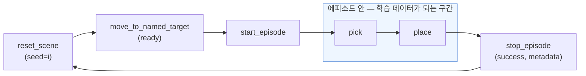
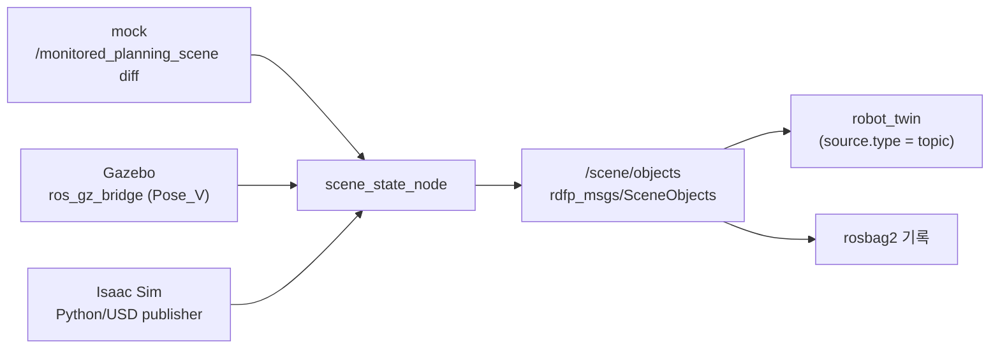

# 자동 에피소드 수집을 위한 트윈 확장 (초안)

> **상태: 작업 기록 — §6 의 1~5b 완료, 6~7 미착수 (갱신 2026-08-22).** 2026-08-17 논의를
> 정리한 초안으로 시작했으나 이후 작업이 이 문서 안에서 진행되어, **절 제목에
> `(구현 완료, 2026-08-17)` 또는 `(결정, 2026-08-17)` 이 붙은 것은 이미 코드에 반영된
> 내용**이다. 남은 것은 Gazebo 연동(§6 작업 6) · Isaac 연동(§6 작업 7) 과 §7 의
> 용어 분리(조건부 보류)뿐이다.
>
> 확정 내용을 정식 문서 ([robot_twin_design.md](robot_twin_design.md), [robot_twin_user_guide.md](robot_twin_user_guide.md), [../simulation/multi_simulator_backend_design.md](../simulation/multi_simulator_backend_design.md))로 옮기고 이 파일을 삭제하는 계획은 그대로 유효하다.
>
> 완료 표시가 없는 절의 YAML·메시지 정의는 **제안**이며 이름·필드가 확정 전이다.
>
> 경로 표기는 **제어 계층 패키지 분리 이후** 기준이다 — 최초 작성 당시 트윈은 `rdfp` 패키지의 `twin/` 서브패키지였고 scene 노드도 `rdfp` 에 있었으나, 지금은 각각 독립 패키지 `robot_twin` 과 제어 계층 `robot_control` 소속이다.

---

## 0. 목표

**물체 위치를 매 회 랜덤화하면서 스크립트 pick-and-place 를 반복해 에피소드를 자동으로 찍어내는 것.** 사람이 티칭하지 않고도 학습 데이터를 양산하는 경로다.

이를 위해 로봇 트윈에 필요한 상태 변수·연산을 정한다. 클라이언트는 `~/development/mdtpy/robot-twin` (사용 설명서 5.9 예제를 옮긴 별도 프로젝트) 처럼 **HTTP 만으로** 루프를 돌 수 있어야 한다 — 중간에 ROS 서비스를 직접 불러야 한다면 트윈의 전제가 깨진다.

수집 루프는 다음과 같다. **어디까지가 에피소드 안인지가 설계의 핵심**이다.



물체 순간이동(`reset_scene`)과 홈 복귀(`move_to_named_target`)는 **에피소드 밖**이어야 한다. 안에 들어가면 물리적으로 불가능한 장면이 학습 데이터에 섞인다.

---

## 1. mock / Gazebo / Isaac 을 모두 지원할 수 있는가

**인터페이스는 통일할 수 있고, 그렇게 해야 한다. 다만 의미는 통일되지 않는다.**

| 백엔드 | pose 의 출처 | 물체가 스스로 움직이나 | 실패를 **관측**할 수 있나 |
|---|---|---|:-:|
| mock (MoveIt planning scene) | 내가 넣은 값 | ✗ | **✗** |
| Gazebo (gz-sim, Fortress) | 물리 엔진 | ✓ | ✓ |
| Isaac Sim | 물리 엔진 | ✓ | ✓ |

mock 의 planning scene 물체는 **절대 움직이지 않는다.** 파지에 실패해도, 놓다가 굴러떨어져도 pose 가 그대로다. 물체를 그리퍼에 따라오게 하려면 `AttachedCollisionObject` 를 클라이언트가 선언해야 하는데, 그 순간 "성공했다고 선언했으니 성공"인 **자기충족 라벨**이 된다.

→ **mock 지원의 값은 배관 검증이다.** 변수·연산·기록 경로가 도는지 확인하는 용도이며, 실제 에피소드 수집은 Gazebo 이상에서만 성립한다.

> **`simulated` 플래그는 두지 않는다 (결정, 2026-08-17).** mock 은 테스트 중에만 쓰고 실제 수집에는 사용하지 않으므로, "mock 데이터가 학습셋에 섞이는" 상황 자체가 운용상 발생하지 않는다. 메시지에 필드를 더하면 세 백엔드 모두가 그 값을 채울 책임을 지게 되는데, 막으려는 사고가 없다면 값을 치르는 쪽만 남는다.
>
> 나중에 출처를 남길 필요가 생기면 **에피소드 `metadata` (jsonb, §4.5)** 가 자연스러운 자리다 — 자유 형식이라 메시지·스키마를 고치지 않고 `backend: 'mock'` 을 넣을 수 있다.

---

## 2. 상태 변수 `scene_objects`

### 2.1 배선 — 트윈은 코드를 고치지 않는다

`robot_twin/variables.py` 는 `topic` 과 `static` 두 소스만 구현되어 있다 (`SourceType` Literal 에는 `tf`/`service`/`derived` 도 있으나 미배선). 따라서 **백엔드마다 "scene 상태를 ROS 토픽으로 내는 노드"를 하나씩 두고, 트윈은 토픽 하나만 구독**하는 형태가 맞다.



이 구조의 이점은 세 가지다.

1. **트윈 설정이 세 백엔드에서 동일**해지고, 트윈 코드 변경이 0 이다 (YAML 만 추가).
2. "트윈은 환경 구현을 모른다" 는 원칙이 유지된다. 트윈 안에 백엔드 분기를 넣는 순간 그 원칙이 깨지고, 백엔드가 늘 때마다 트윈을 고치게 된다.
3. 토픽이므로 **rosbag2 에 그대로 기록된다.** 트윈만 보는 채널로 만들면 물체 위치가 데이터셋에 남지 않는다 — `rdfp_msgs/GripperCommand` 를 만든 것과 같은 이유다. **적재까지 배선 완료 (2026-08-23)** — `config/recording_topics.list` 등록 + `scene_objects` 테이블 + writer/reader. 관측으로 쓸지는 별개다(§5).

[멀티 시뮬레이터 백엔드 설계안](../simulation/multi_simulator_backend_design.md) §5.3 은 "world 정의 / 환경 오브젝트" 를 선택(MAY) 으로 두고 있다. 이 작업은 그것을 **`/scene/objects` 토픽 계약으로 승격**하는 것에 해당한다.

### 2.2 메시지 타입 (구현 완료, 2026-08-17)

`geometry_msgs/PoseArray` 는 **이름이 없어 물체를 식별할 수 없으므로** 쓸 수 없었다. 새 타입 둘을 만들었다 — 상세 주석은 실물에 있다.

- [`rdfp_msgs/msg/SceneObject.msg`](../../src/rdfp_msgs/msg/SceneObject.msg) —
  `name` / `type` / `dimensions` / `pose`
- [`rdfp_msgs/msg/SceneObjects.msg`](../../src/rdfp_msgs/msg/SceneObjects.msg) —
  `header` + `SceneObject[] objects`

못 박은 것은 넷이다.

- **`header.stamp` 필수.** 기록되는 채널이므로 비우면 `extract_stamp` 가 epoch 0 으로 적재해 **어느 에피소드에도 속하지 못한다.** 로봇은 정상 동작하므로 데이터를 열어보기 전까지 드러나지 않는다.
- **`header.frame_id` 는 로봇 베이스 프레임**(현재 스택에서는 `panda_link0`). Gazebo 의 world frame 은 로봇 베이스와 다르므로 변환 책임은 발행 노드가 진다. 여기서 안 맞추면 세 백엔드가 각자 다른 좌표를 내보내고 데이터셋이 조용히 오염된다.
- **`orientation` 은 ROS 규약 xyzw.** 좌표계 고정과 같은 성격의 표현 규약이며, 역시 발행 노드가 맞춘다. Isaac 은 wxyz(스칼라 우선)라 그대로 옮기면 조용히 틀린다 — §2.5.
- **`type` 은 `uint8` 이 아니라 `string`.** 트윈의 `enums` 가 중첩 필드에 닿지 않아 숫자가 그대로 노출되기 때문이다 — 근거는 §2.4.

`dimensions` 가 가변 길이라는 점 때문에 **JointState 식 병렬 배열(`string[] name` + `Pose[] pose` + …)로는 표현할 수 없다.** ROS IDL 에 ragged array 가 없다. 배열-of-구조체가 유일한 선택이며, 이것이 §2.4 의 projection 결정을 낳는다.

> **`dimensions` 순서는 `shape_msgs/SolidPrimitive` 를 그대로 따른다.** 초안에는 cylinder 를 "반지름, 높이" 로 적었으나 SolidPrimitive 는 `CYLINDER_HEIGHT=0`, `CYLINDER_RADIUS=1` 즉 **높이·반지름** 순이다. 자체 순서를 정하면 mock 백엔드가 planning scene 의 값을 재배열해야 하고, **그 재배열이 조용히 틀릴 수 있는 지점을 새로 만든다.** 직관과 반대라 `.msg` 주석에 경고를 달아 두었다.

물리 유무를 나타내는 `simulated` 플래그는 **두지 않는다** — 근거는 §1.

### 2.3 트윈 설정 (구현 완료, 2026-08-17)

```yaml
- name: scene_objects
  source:
    type: topic
    topic: /scene/objects
    msg: rdfp_msgs/msg/SceneObjects
    qos: { reliability: reliable, durability: transient_local, depth: 1 }
  # objects[] 를 {name: {...}} 로 정규화한다 (§2.4). joint_states 용과 다른 변환이다.
  projection: scene_object_map
  staleness_ms: 1000
  units:
    position: m
    orientation: quaternion_xyzw
```

`transient_local` 로 두면 늦게 뜬 트윈도 현재 scene 을 즉시 본다 (`/session` 과 같은 근거).

### 2.4 projection 과 enums — 확인 결과 (2026-08-17)

기존 `projection: name_value_map` 을 재사용하려 했으나 **불가**하다. 코드를 읽고 실제로 돌려 확인했다.

```
projection -> SerializationError: JointState-like message has empty "name"; cannot build map
enums      -> {'objects': [{'name': 'cube_0', 'type': 1, ...}]}    # type 이 숫자 그대로
```

#### (1) `name_value_map` 은 JointState 전용이다

[serialize.py:104-158](../../src/robot_twin/robot_twin/serialize.py#L104-L158) 이 네 가지를 하드코딩한다.

| # | 전제 | 위반 시 (조사 당시) | 현재 |
|:-:|---|---|---|
| 1 | 최상위에 `name` 이라는 **리스트**가 있다 | 스칼라는 통과 → `name` 소실 | `SerializationError` |
| 2 | 변환 대상은 `position`/`velocity`/`effort` **셋뿐** (문자열 리터럴) | 조용히 무시 → 대응 관계 소실 | `SerializationError` |
| 3 | **병렬 배열** — `name[i]` ↔ `position[i]` | 길이 불일치 시 `SerializationError` | 동일 |
| 4 | 결과에서 `name` 키를 제거한다 | — | 동일 |

`SceneObjects` 는 배열-of-구조체라 1번에서 즉시 걸린다. 실패는 [variables.py:433-440](../../src/robot_twin/robot_twin/variables.py#L433-L440) 이 잡아 500 이 아니라 `quality: ERROR` + `SERIALIZATION_FAILED` 로 나오지만, **기동 시점이 아니라 첫 조회 때** 드러난다 — config 검증에서 걸리지 않는다.

> **조치 완료 (2026-08-17).** 1·2 번의 조용한 손실을 명시적 실패로 바꾸고, 함수명을 `project_name_value_map` → **`project_joint_state_map`** 으로 좁혔다. 범용처럼 보이는 이름이 오용을 부르던 것이 원인의 일부였다. **설정값 `projection: name_value_map` 은 그대로 두었다** — 공개 설정 표면이라 새 projection 어휘와 함께 정했다 (§6.1).

#### (2) 왜 joint_states 는 projection 이 "필요"했나

`JointState` 는 병렬 배열이라 **인덱스가 밀리면 값이 뒤섞인다.** `position[3]` 이 어느 관절인지 `name[3]` 없이 알 수 없고 ROS 는 순서를 보장하지 않는다 — **정확성 문제**였다.

`SceneObjects` 는 각 원소가 자기 `name` 을 들고 있어 **순서가 바뀌어도 값이 섞이지 않는다.** 정보 손실이 없으므로 **편의 문제**다. 성격이 다르다.

#### (3) 결정: projection 을 신규 추가하고, **처음부터** 적용한다

편의 문제이므로 "나중에" 가 가능해 보이지만, **배열 → map 은 breaking change** 다. 지금은 이 변수를 읽는 클라이언트가 하나도 없어 **공짜**이고, 나중엔 마이그레이션이 붙는다. 비용도 작다.

| 파일 | 변경 |
|---|---|
| [serialize.py](../../src/robot_twin/robot_twin/serialize.py) | 함수 하나 (~20줄) |
| [config.py](../../src/robot_twin/robot_twin/config.py) | `projection` Literal 에 값 추가 |
| [variables.py](../../src/robot_twin/robot_twin/variables.py) | `PROJECTIONS` 표에 한 줄 |

`name` 키는 `joint_states` 와 맞춰 **제거**한다 (map 의 키로 이미 들어간다).

#### (4) `enums` 는 중첩 필드에 닿지 않는다

[serialize.py:151-158](../../src/robot_twin/robot_twin/serialize.py#L151-L158) 의 `apply_enums` 는 **최상위 dict 의 키만** 훑는다. `gripper_last_command_result.status` 가 심볼로 나오는 것은 그것이 최상위 필드이기 때문이다.

변환 순서가 `to_jsonable` → `projection` → `apply_enums` 이므로, projection 으로 map 을 만든 뒤에도 `type` 은 여전히 한 겹 안쪽이라 닿지 않는다.

→ **`SceneObject.type` 을 `string` 으로 둔다** (§2.2). 트윈 변경이 필요 없고, 기록되는 채널이라 데이터셋 가독성에도 낫다. `apply_enums` 를 중첩 지원으로 확장하려면 경로 표기(`objects.*.type`)가 필요해져 config 만 복잡해지고 얻는 것이 없다.

### 2.5 백엔드 좌표 규약 어댑터 (결정, 2026-08-17)

**변환은 전부 백엔드 발행 노드가 한다.** 좌표계(`panda_link0`)·단위·쿼터니언 순서가 모두 같은 성격의 표현 규약이므로 한 자리에 모은다.

| 후보 | 판단 |
|---|---|
| **백엔드 publisher** | **채택.** 프레임 변환과 한 몸이다 |
| 트윈 | 반대. "트윈은 환경 구현을 모른다"(§2.1)가 깨지고 백엔드마다 분기가 생긴다 |
| 소비자(학습 코드) | 최악. **데이터셋 안에 두 규약이 섞인 채로** 저장된다 |

#### Isaac 의 쿼터니언은 조용히 틀린다 ⚠️

Isaac 은 **wxyz(스칼라 우선)**, ROS 는 xyzw 다. 순서만 다르므로 **둘 다 float 4개이고 둘 다 unit norm** 이라 타입 검사도 정규화 검사도 전부 통과한다. 크래시가 아니라 **그럴듯하게 틀린 자세**가 나온다.

```
Isaac 의 "회전 없음"    (w,x,y,z) = (1, 0, 0, 0)
순서만 옮기면           (x,y,z,w) = (1, 0, 0, 0)   ← x축 180° 회전
```

하필 `(1,0,0,0)` 은 pick 예제의 `DOWN` 상수, 즉 **"그리퍼가 아래를 본다"** 는 지극히 정상적인 자세다. 로그로도 `ros2 topic echo` 로도 RViz 로도 이상해 보이지 않는다. `simulated` 플래그를 두지 않기로 했으므로(§1) 사후에 출처를 되짚을 수단도 없다.

#### 검증 방법 — norm 검사는 무력하다

양쪽 다 통과하므로 다음 셋으로 확인한다.

| 검증 | 내용 |
|---|---|
| **identity** | 회전 없는 물체를 놓고 `(0,0,0,1)` 이 나오는지 본다. 틀리면 `(1,0,0,0)` 이라 **즉시 갈린다.** 가장 값싸다 |
| **비대칭 회전** | identity 만으로는 부족하다. z축 90°는 wxyz `(0.707,0,0,0.707)` / xyzw `(0,0,0.707,0.707)` 로 **둘 다 유효한 unit quaternion 이면서 서로 다른 회전**이다. 축이 섞이는 케이스가 있어야 순서 오류가 잡힌다 |
| **TF 교차 검증** | 그리퍼가 물체를 쥔 순간 EE pose(이미 ROS 규약)와 물체 자세가 일치해야 한다. 수집 루프 안의 상시 검증으로 쓸 수 있다 |

#### 순서만 다른 게 아니다

이 항목을 "쿼터니언"으로 좁히면 나머지를 놓친다. 어차피 같은 어댑터에서 처리한다.

| 규약 | 위험도 |
|---|---|
| 쿼터니언 wxyz | **높음** — 조용히 틀린다 |
| `metersPerUnit` (USD stage 단위, cm asset 이 흔하다) | 낮음 — 100배라 금방 드러난다 |
| up-axis (외부 USD asset 은 Y-up 이 흔하다) | 중간 |

### 2.6 mock 백엔드는 서비스 폴링이 아니라 diff 누적이다 (실측 후 변경, 2026-08-17)

§2.1 은 mock 을 `/get_planning_scene` **폴링**으로 잡았다. "토픽은 diff 라 상태를 누적해야 하지만 서비스는 완전한 스냅샷을 준다" 는 이유였는데, **이 스택에서는 성립하지 않았다.**

```
물체 3개가 있는 상태에서 1초 간격 10회 조회 → [3, 0, 0, 0, 0, 0, 3, 3, 3, 0]
```

배제한 원인:

| 의심 | 결과 |
|---|---|
| 요청 컴포넌트 마스크 | `WORLD_*` 조합 셋 모두 동일하게 진동 |
| 내 노드와의 동시 조회 | 노드를 끄고 단독 조회해도 진동 |
| RViz 가 `/planning_scene` 을 덮어씀 | RViz 종료 후에도 진동 (`/planning_scene` 발행자 0) |

move_group 의 planning scene monitor 가 diff scene 과 parent 를 오가는 것으로 보인다. **서비스는 이 스택에서 신뢰할 수 있는 스냅샷 소스가 아니다.**

#### 채택: `/monitored_planning_scene` diff 누적

노드가 `is_diff` 와 `operation`(ADD/REMOVE/MOVE/APPEND)을 반영해 상태를 들고 있는다. 함정 세 가지를 테스트로 고정했다.

- **`is_diff=True` 에 물체가 없는 것은 "scene 을 비우라"가 아니다.** 로봇 상태만 바뀐
  diff 도 같은 토픽으로 온다. 비움으로 해석하면 물체가 매 주기 사라져 **서비스 폴링과
  똑같은 증상**이 된다
- `is_diff=False` 인 빈 scene 은 반대로 "전부 지웠다"가 맞다
- `REMOVE` 에 id 가 비면 **전체 제거**다 (MoveIt 규약)

#### 구독은 이벤트, 발행은 주기 유지

두 가지 때문이다.

1. 물리 백엔드(Gazebo/Isaac)는 물체가 계속 움직여 주기 발행이 자연스럽다. mock 만 이벤트성이면 트윈의 `staleness_ms` 를 백엔드별로 달리 잡아야 한다
2. **발행자가 죽은 것을 감지할 수 있다.** 이벤트 발행이면 scene 이 조용히 얼어붙은 것과 정상인 것이 구분되지 않는다

덕분에 §2.3 의 `staleness_ms: 1000` 을 그대로 둘 수 있었다.

> **QoS 함정**: `/monitored_planning_scene` 은 RELIABLE / **VOLATILE** 로 발행된다.
> TRANSIENT_LOCAL 로 구독하면 QoS 불일치로 **한 건도 받지 못한다** — 경고만 뜨고
> 조용히 아무 일도 일어나지 않는다.

라이브 확인: ADD 2개 → 20초간 안정, `MOVE` 로 위치 갱신, `REMOVE` 로 제거까지
HTTP 응답에 그대로 반영됐다.

---

## 3. 연산 `reset_scene`

### 3.1 저수준 API 를 열지 않는다

| 후보 | 판단 |
|---|---|
| `spawn_object` / `remove_object` / `set_object_pose` | **반대.** scene 구성 로직이 클라이언트로 새어 나가고, "어떤 배치였는지"가 데이터셋 밖에 남는다. 그리퍼에서 심볼을 버리고 숫자를 실은 것과 같은 문제다 |
| `randomize_scene(seed)` | 인자가 늘수록 파라미터 괴물이 된다 |
| **`reset_scene(scene, seed)` + 레시피를 config 에** | **채택.** `move_gripper_to_target` 의 `backend.targets` 와 같은 패턴이다 |

### 3.2 배선은 그리퍼와 동일하다

명령 토픽 + result 변수 구조를 그대로 재사용한다. `robot_twin/backends.py` 의
`_send_gripper_command` 를 일반화하면 새 핸들러가 사실상 필요 없다.

```yaml
- name: reset_scene
  kind: sync                  # 물리 안정화 대기가 길어지면 async 로 (§7)
  resource: scene
  idempotent: false
  backend:
    topic: /scene/commands
    topic_type: rdfp_msgs/msg/SceneCommand
    result_variable: scene_last_command_result
    scenes:
      one_cube:
        objects:
          - { type: box, size: [0.05, 0.05, 0.05],
              x: [0.35, 0.55], y: [-0.15, 0.15], z: 0.025 }
  inputs_schema:
    type: object
    required: [scene]
    properties:
      scene: { type: string }      # enum 은 backend.scenes 에서 파생한다
      seed:  { type: integer }
    additionalProperties: false
  sync_timeout_sec: 10.0
```

`scene` 의 `enum` 은 **YAML 에 적지 않는다** — `backend.scenes` 에서 파생시킨다
(`OperationConfig._derive_target_enum` 과 같은 방식). 두 곳에 적으면 조용히 어긋난다.

### 3.3 outputs 가 결정적이다

**`seed` 만 기록해서는 재현되지 않는다.** 백엔드의 RNG 구현이 바뀌거나 백엔드가
달라지면 같은 seed 가 다른 배치를 만든다. **실제로 배치된 pose 를 outputs 로 돌려받아
에피소드 메타데이터에 저장**해야 한다 — 지금은 그 자리가 없다 (§4.5).

```json
{"status": "COMPLETED",
 "outputs": {"scene": "one_cube", "seed": 42,
             "objects": [{"name": "cube_0", "type": "box",
                          "pose": {"position": {"x": 0.41, "y": -0.06, "z": 0.025}, "...": "..."}}]}}
```

### 3.4 자원 락 — `resource` 를 리스트로 확장한다 (결정, 2026-08-17)

`scene` 자원을 새로 만들고 **`reset_scene` 은 `[scene, arm]` 둘을 함께 점유**한다.

#### 막아야 하는 방향이 둘이다

| 방향 | 왜 |
|---|---|
| arm 이 움직이는 중 → `reset_scene` 거부 | 이동 중 물체 순간이동은 Gazebo 에서 물리적으로 튄다 |
| `reset_scene` 중 → arm 연산 거부 | **이쪽이 더 위험하다.** 물체가 스폰·재배치되는 도중 팔이 그 공간으로 들어간다 |

#### 검토한 대안과 기각 사유

| 안 | 내용 | 판단 |
|:-:|---|---|
| **A** | `resource` 를 리스트로 확장 | **채택** |
| B | `resource: scene` + "arm 점유 중이면 409" 사전조건 | **기각.** `scene` 만 점유하므로 **위 표의 두 번째 방향이 열려 있다.** 게다가 [runtime.py:241](../../src/robot_twin/robot_twin/runtime.py#L241) 의 `_check_preconditions` 는 [runtime.py:244](../../src/robot_twin/robot_twin/runtime.py#L244) 의 `sessions.create` 보다 먼저, 즉 `SessionStore._lock` **밖**에서 돌아 검사·점유 사이에 창이 있다. 그 창을 없애려 검사를 락 안으로 옮기면 결국 A 와 같은 코드가 된다 |
| C | `scene` 자원을 만들지 않고 `reset_scene` 이 `arm` 을 점유 | **기각.** 코드 변경 0 으로 두 방향을 다 막지만, `/resources` 에 scene 작업이 드러나지 않는다 — 수집 루프가 멈췄을 때 "무엇이 점유 중인가" 가 디버깅의 출발점이다(사용 설명서 5.9 의 `TimeoutError` 핸들러). scene 만 건드리는 연산이 생기면 결국 A 로 온다. **급할 때의 우회책으로만 기억한다** |

#### A 가 싼 이유 — 데드락 걱정이 없다

다중 자원 락은 보통 락 순서·부분 획득·데드락을 낳지만 **이 구조에서는 해당 없다.**
[session.py:182-206](../../src/robot_twin/robot_twin/session.py#L182-L206) 의 `create()` 가 검사→점유→세션
생성을 **하나의 `self._lock` 안에서 전부-또는-전무**로 처리하기 때문이다. 통상적인
비용이 들지 않아 ~40줄 규모다.

남는 실제 이슈는 **starvation** 하나 — arm 이 계속 바쁘면 `reset_scene` 이 못 잡는다.
수집 루프는 순차 실행이라 실무적으로 걸릴 일이 없다.

#### 고칠 곳

| 위치 | 변경 |
|---|---|
| [config.py:30,190](../../src/robot_twin/robot_twin/config.py#L30) | `ResourceName` 에 `scene` 추가 + `list[ResourceName]` 허용 |
| [session.py:188-203](../../src/robot_twin/robot_twin/session.py#L188-L203) | 검사·점유를 루프로 |
| [session.py:246](../../src/robot_twin/robot_twin/session.py#L246) | 해제를 루프로 |
| [errors.py:68](../../src/robot_twin/robot_twin/errors.py#L68) | `resource_busy(resource: str, …)` — **어느 자원이 막았는지** 응답에 담기 |
| [session.py:288](../../src/robot_twin/robot_twin/session.py#L288) | `resources()` 의 `('arm','gripper')` 하드코딩 제거 → config 에서 수집 |

마지막 두 줄이 놓치기 쉽다. `resources()` 를 함께 고치지 않으면 **`scene` 이 응답에서
조용히 빠진다.**

> **시점: §6 의 5번 작업(`reset_scene` 구현) 에서 한다.** 그 전에는 `scene` 자원이
> 존재할 이유가 없다.

### 3.5 무작위 추출은 트윈이 한다 (구현, 2026-08-17)

명령 토픽(`/scene/commands`)에는 **이미 정해진 배치**가 실린다. 백엔드 노드는 그대로 적용만 한다.

백엔드가 뽑게 하면 두 가지가 깨진다.

- 같은 seed 로도 **백엔드마다 다른 배치**가 나온다 (mock/Gazebo/Isaac 의 RNG 가 다르다)
- 트윈이 실제 배치를 몰라 **에피소드 metadata 에 남길 수 없다**

레시피는 `backend.scenes` 에 두고 축마다 숫자(고정) 또는 `[최소, 최대]`(균등 추출)를 받는다. `scene` 의 enum 은 그 표에서 파생한다 — 그리퍼 `targets` 와 같은 방식이며, `_derive_enum_from` 으로 일반화했다.

> **`outputs.objects` 가 재현의 근거다.** seed 는 사람이 실행을 식별하는 용도일 뿐, 추출 방식이 바뀌면 같은 seed 가 다른 배치를 만든다. 호출자는 `objects` 를 `stop_episode` 의 metadata 로 넘겨 에피소드에 붙인다.

결과 채널은 `/scene/command_results` 를 따로 둔다. **`/scene/objects` 를 결과로 쓰면
안 된다** — 그쪽은 주기 발행이라 명령과 무관하게 갱신되므로, '갱신됨'을 완료 신호로
삼으면 리셋 이전 상태를 완료로 오인한다.

라이브 확인:

```
seed=1  cube_0 (0.377, 0.104, 0.025)      ← 같은 seed 는 같은 배치
seed=2  cube_0 (0.541, 0.134, 0.025)
seed=1  cube_0 (0.377, 0.104, 0.025)
arm 이동 중 reset_scene → 409 RESOURCE_BUSY  ← §3.4 의 양방향 배타
```

### 3.6 Gazebo 실측 — sync 로 충분하다 (2026-08-17)

`reset_scene` 을 sync 로 둘지 async 로 둘지는 **물리 안정화 대기 시간**에 달려 있었다. Gazebo Fortress(`empty.sdf`, 5 cm 상자 0.1 kg)에서 쟀다.

| 항목 | 측정값 |
|---|---|
| `create` 서비스 왕복 | **388 ms** (5회: 383/388/389/389/403) |
| 스폰 높이 = 안착 높이(z=0.025) | **움직이지 않는다** (z 0.0250 → 0.0250) |
| 5 cm 위에서 낙하 | 움직이지 않는다 — 아래 물체 위에 그대로 안착 |
| 20 cm 위에서 낙하 | z 0.3250 → 0.1250, **안정까지 약 1.7 s** |
| `dynamic_pose/info` 발행 | 55 Hz |

**결론: sync 로 충분하다.** 최악(20 cm 낙하)이 스폰 388 ms + 안정화 1.7 s ≈ **2.1 s** 로 현재 `sync_timeout_sec: 10.0` 안에 넉넉히 들어온다.

레시피가 물체를 **안착 높이에 놓기 때문에**(`z: 0.025` = 상자 절반) 실제 수집 루프에서는 낙하 자체가 없다 — 안정화 대기가 0 이다. 낙하를 의도적으로 넣더라도 sync 가 유효하다.

> 측정 주의 두 가지. (1) `dynamic_pose/info` 는 `position` 과 `orientation` **양쪽에 `z:` 필드가 있어** 순진하게 파싱하면 값이 번갈아 잡히고 "영원히 안 멈춤"으로 보인다. (2) 안정 판정 창(20 샘플 ≈ 361 ms)이 하한이므로, 안착 높이 스폰의 "330 ms" 는 실제 움직임이 아니라 **판정 창 그 자체**다.

---

## 4. 가장 큰 구멍 — 트윈에 에피소드 경계가 없다

`robot_twin/` 전체에 session/episode 개념이 **하나도 없다.** 현재 `/session` 은 `session_control_node` 가 관리하고, 클라이언트가 ROS 서비스를 직접 불러야 한다.

그러면 **"HTTP 만으로 로봇을 쓴다" 는 트윈의 전제가 깨진다.** 수집 스크립트가 rclpy 의존을 갖게 되고, 트윈을 쓰는 의미가 절반 사라진다.

> **판단: `start_episode` / `stop_episode` 가 `scene_objects` 보다 우선순위가 높다.**
> scene 랜덤화가 없어도 손으로 배치를 바꾸며 수집은 가능하지만, 에피소드 경계가
> 없으면 루프 자체가 성립하지 않는다.

### 4.1 `/session` 의 주인 — `session_control_node` 로 유지한다 (결정, 2026-08-17)

**트윈은 `SessionControlClient` 를 쓰는 클라이언트가 된다.** `/session` 을 직접 발행하지 않는다.

#### "주인" 이란

`/session` 은 토픽이 아니라 **상태 기계의 외부 표현**이다.
[session_control_node.py](../../src/rdfp/rdfp/session/session_control_node.py) 가 네 가지를 혼자 한다.

1. 상태 보유 — `IDLE` / `IN_SESSION` / `IN_EPISODE`
2. 전이 규칙 강제 — `start_session` 은 `IDLE` 에서만, `start_episode` 는 `IN_SESSION` 에서만
3. 전이마다 `/session` 발행 — `TRANSIENT_LOCAL` / `RELIABLE` / `depth=1`
4. 쓰기 창구를 서비스 6개로 한정 (`~/start_session` … `~/get_session_state`)

**토픽은 읽기 전용 브로드캐스트이고 쓰기는 서비스로만** 일어난다. 발행자가 하나라는 것이 이 구조의 전제다.

#### 직접 발행(기각안)이 깨뜨리는 것

| # | 문제 |
|:-:|---|
| 1 | **TRANSIENT_LOCAL 발행자가 둘이 된다.** 늦게 붙은 recorder 가 두 발행자의 latched 샘플을 각각 받고 순서 보장이 없다. "붙자마자 현재 상태를 본다" 는 전제가 무너진다 — 대부분 맞게 돌다 가끔 에피소드 경계가 어긋나는 **조용한** 고장이다 |
| 2 | **전이 규칙이 우회된다.** `IN_SESSION` 없이 `IN_EPISODE` 로 갈 수 없다는 불변식이 노드 안에만 있다. `stop_session` 이 `IN_EPISODE` 에서 `(IN_SESSION → IDLE)` 을 **2회 발행**하는 세부 규약까지 복제해야 하고, 복제한 순간 둘은 갈리기 시작한다 |
| 3 | **트윈이 여러 대일 수 있다** (사용 설명서 7장). writer 가 트윈 수만큼 늘어난다 |

#### 채택안이 싼 이유

[session_control_client.py](../../src/rdfp/rdfp/session/session_control_client.py) 의
`SessionControlClient` 에 **`start_episode_async` / `stop_episode_async` 가 이미 있다** —
트윈의 비동기 연산 배선에 그대로 맞는다.

결과적으로 트윈의 역할은 **HTTP → ROS 서비스 어댑터**로 정리된다. 그리퍼에서 내린
결정과 같은 형태다 — 트윈은 액션을 직접 부르지 않고 `gripper_control_node` 를 거친다.

### 4.2 `episode` 는 자원으로 만들지 않는다 (결정, 2026-08-17)

배타 제어는 **`session_control_node` 의 상태 기계에 맡기고**, 트윈에 `episode` 자원을
추가하지 않는다.

#### 자원 락이 구조적으로 맞지 않는다

트윈 자원 락의 수명은 **연산 실행 시간**이다 —
[runtime.py:244](../../src/robot_twin/robot_twin/runtime.py#L244) 에서 잡고 세션이 끝나면 풀린다
(sync 연산도 같다). `start_episode` 는 서비스 호출 하나라 **ms 안에 끝나므로 락도 즉시
풀린다.**

그런데 지켜야 할 구간은 `start_episode` **와** `stop_episode` **사이**이고, 그 사이에는
pick·place 가 계속 돌아야 한다. 즉 `resource: episode` 는 **에피소드 창을 1 ms 도
보호하지 못한다.**

억지로 맞추려면 두 연산에 걸치는 락이 필요하고, 그러면 pick·place 도 `episode` 를
잡아야 의미가 생긴다 — 그건 **이미 있는 상태 기계를 락으로 재구현**하는 것이다.
에피소드는 배타 점유(락)가 아니라 **모드(상태)** 다.

> 운용상 트윈과 teleop GUI 중 하나만 쓴다는 것도 근거가 되지만, 그것만으로는 약하다 —
> **트윈 자체가 다중 세션**이라 HTTP 클라이언트 둘이 동시에 `start_episode` 를 부르는
> 경우는 GUI 와 무관하게 남는다. 그 경우도 상태 기계가 거부하므로 결론은 같다.

#### 대신 정해야 할 것 — 오류 매핑

보호를 전부 상태 기계가 하게 되면, **그 거부를 HTTP 로 어떻게 내보낼지**가 새 결정이
된다. 서비스는 예외를 던지지 않고 `(False, reason)` 을 돌려주기 때문이다.

**`PRECONDITION_FAILED` 로 매핑했다** ([errors.py](../../src/robot_twin/robot_twin/errors.py) 에
이미 있는 코드라 신설이 필요 없었다). 서비스가 준 `reason` 을 message 에 그대로 싣는다 —
안 그러면 클라이언트가 거부 사유를 알 수 없다.

구현에서는 백엔드 예외를 둘로 나눴다. 기존 `BackendUnavailable` 은 전부
`EXECUTION_ABORTED` 로 나가는데, 상태 기계의 거부는 **실행이 중단된 것이 아니라
아무것도 실행되지 않은 것**이라 그 코드가 틀리다. 클라이언트의 대응도 다르다 —
재시도가 아니라 상태를 먼저 맞춰야 한다. 그래서 `PreconditionFailed` 를 신설하고
`_run_sync` 에서 별도로 매핑했다.

```
IDLE 에서 start_episode → status=FAILED, code=PRECONDITION_FAILED,
                          message="start_episode rejected: invalid command"
```

`COMPLETED` + `success: false` 형태는 피한다. 수집 루프가 반환값을 확인하지 않고
진행하면 **에피소드 없이 pick 이 돌아 데이터가 통째로 유실**된다.

### 4.3 읽기 경로 — `session_state` 변수 (구현 완료, 2026-08-17)

§4.2 로 자원이 빠지면서 `/resources` 에는 에피소드 상태가 드러나지 않는다. 이 변수가
**"지금 에피소드 중인가" 를 확인할 유일한 수단**이며, 열린 채 남은 에피소드를 감지·
복구하는 근거도 이것뿐이다.

**`/session` 구독으로 배선했다** (`get_session_state` 서비스 호출이 아니라). 이유는 둘이다.

- `variables.py` 는 `topic` 과 `static` 만 구현되어 있다. `service` 소스는 `SourceType`
  Literal 에만 있고 미배선이라 서비스 방식은 트윈 코드 변경이 따라온다
- `SessionCommand.state` 가 이미 `'IDLE'|'IN_SESSION'|'IN_EPISODE'` **문자열**이라
  `enums` 도 필요 없다

결과적으로 **YAML 만 추가**했다 (`robot_twin_panda01.yaml`).

두 가지가 함정이다.

- **`durability: transient_local` 필수.** 원본이 TRANSIENT_LOCAL 이라 `volatile` 로
  구독하면 매칭 자체가 안 되어 값이 영영 오지 않는다
- **`staleness_ms: null`.** 전이 시점에만 발행되므로 주기성이 없다. 한 시간째
  `IN_SESSION` 인 것은 낡은 값이 아니라 현재 값이다

실측으로 `IDLE → IN_SESSION → IN_EPISODE → IN_SESSION → IDLE` 전 구간이 `quality: OK`
로 반영되는 것을 확인했다. 트윈을 **에피소드 도중에 새로 띄웠을 때도** TRANSIENT_LOCAL
덕에 즉시 `IN_EPISODE` 를 받았다.

### 4.4 연산 4개 + 경계 제어는 전적으로 클라이언트 책임 (결정, 2026-08-17)

#### 왜 `start_episode` / `stop_episode` 두 개로는 안 되는가

```python
# session_control_node._handle_start_episode
if self._state is not SessionState.IN_SESSION:
    return self._reject('start_episode', response)
```

`start_episode` 는 **`IN_SESSION` 에서만** 허용된다. 두 개만 노출하면 세션을 여는 주체가
없어 **모든 `start_episode` 가 거부되고 루프가 시작조차 못 한다.**

암묵적으로 세션을 여는 안은 기각했다 — **`task_label` 을 붙일 자리가 사라진다.** 라벨은
세션 단위로 설정되어 `/session` 메시지에 실려 bag 에 기록되고, 거기서 DB 의 에피소드
행으로 들어간다. 빈 라벨로 시작하면 **그 세션의 모든 에피소드에 빈 라벨이 박히고,
기록이 끝난 뒤에는 재import 로도 못 고친다** (bag 안의 메시지가 이미 비어 있다).

#### 노출하는 연산

| 연산 | kind | 자원 | 입력 |
|---|:-:|:-:|---|
| `start_session` | sync | 없음 | **`task_label`** |
| `stop_session` | sync | 없음 | — |
| `start_episode` | sync | 없음 | — |
| `stop_episode` | sync | 없음 | `outcome`(`success`/`failure`, 생략 = 판정 없음) / `metadata`(JSON **object**) |

`stop_episode` 의 성패 인자는 §4.6 의 결정에 따라 `success`(bool) 가 아니라
**`outcome`(문자열)** 이다 — bool 로는 '판정 없음'을 표현할 수 없다. `metadata` 는
HTTP 로 **객체를 그대로 받고**(클라이언트에 이중 인코딩을 요구하지 않는다) 서비스로
보낼 때 JSON 문자열로 만든다.

전부 서비스 호출 하나라 ms 안에 끝나므로 `move_gripper_to_target` 처럼 **sync** 이고,
§4.2 결정에 따라 **자원을 잡지 않는다.**

`task_label` 은 `start_session` 의 입력으로 받아 트윈이 `set_task_label` → `start_session`
순으로 부른다. 순서가 중요하다 — `set_task_label` 은 `IN_EPISODE` 에서 거부되므로
`IDLE` 일 때 먼저 불러야 한다.

#### 경계 제어는 전적으로 클라이언트 책임

**트윈은 연산이 실패해도 `stop_episode` 를 자동으로 부르지 않는다.** 작업(pick-and-place)
이 끝났든 실패했든 에피소드를 닫는 것은 클라이언트의 역할이다.

근거는 둘이다.

- **자동 수집에서 실패는 정상 경로다.** 파지 실패도 학습 데이터의 일부이므로, 트윈이
  "실패했으니 닫는다" 를 판단하면 **유효한 실패 에피소드를 잘라먹는다.** 무엇이 에피소드의
  끝인지는 작업을 아는 쪽만 안다
- 연산 하나의 실패가 에피소드의 끝이라는 보장이 없다 — 클라이언트가 재시도할 수도 있다

대가는 **클라이언트가 죽으면 에피소드가 열린 채 남는다**는 것이다. 완화책은 트윈에
자동 뒷정리를 넣는 것이 아니라 **멱등한 시작**이다.

```python
# 이전 실행의 잔재를 먼저 정리한다. stop_session 은 IN_EPISODE 에서
# (IN_SESSION → IDLE) 2회 발행으로 에피소드까지 정상적으로 닫는다.
if twin.read('session_state')['state'] != 'IDLE':
    twin.run('stop_session')          # IDLE 에서 부르면 거부되므로 먼저 확인한다

twin.run('start_session', {'task_label': 'pick_red_cube'})
try:
    for seed in range(n):
        twin.run('reset_scene', {'scene': 'one_cube', 'seed': seed})
        twin.run('move_to_named_target', {'target': 'ready'})

        twin.run('start_episode')
        ok = False
        try:
            ok = pick(twin, above, grasp) and place(twin, above2, target)
        finally:
            twin.run('stop_episode', {'success': ok})    # 실패해도 반드시 닫는다
finally:
    twin.run('stop_session')
```

`session_state` 변수(§4.3)가 여기서 값을 한다 — 이 확인이 없으면 `IDLE` 에서 부른
`stop_session` 이 `409` 로 돌아와 루프가 시작 전에 죽는다.

> **적어만 두고 넣지 않는 틈.** `reset_scene` 은 `[scene, arm]` 을 잡지만 `start_episode`
> 는 아무것도 잡지 않으므로, **scene 리셋 중에 에피소드가 시작될 수 있다** (§0 이 금지한
> 상황 — 물체 순간이동이 학습 데이터에 들어간다). 막는다면 자원이 아니라 **사전조건**
> (`scene` 점유 중이면 `start_episode` 거절)이 맞다. §3.4 에서 사전조건을 기각한 것과
> 모순이 아니다 — 거기는 **양방향** 배타가 필요했고 여기는 **한 방향**뿐이다. 수집
> 루프는 한 클라이언트가 순차로 돌므로 실제로는 발생하지 않는다.

### 4.5 `sessions` 스키마 확장 (구현 완료, 2026-08-17)

`task_label` 하나뿐이라 **초기 물체 배치와 seed 를 넣을 자리가 없었다.** 그러면 "어떤
배치에서 실패했는지" 를 분석할 수 없어 랜덤화의 목적 절반이 사라진다.

#### 추가한 컬럼

```sql
success   BOOLEAN,   -- NULL 은 '판정 없음'이며 실패가 아니다
metadata  JSONB      -- seed, scene, 초기 물체 배치, 실패 사유
```

**정규화하지 않고 `jsonb` 로 둔 이유**: `metadata` 의 형태가 scene 레시피와 백엔드마다
달라진다. 정규화하면 레시피를 추가할 때마다 마이그레이션이 따라온다.

**`success` 만 별도 컬럼으로 뺀 이유**: 학습셋을 고를 때 항상 걸리는 조건이라 jsonb
안에 묻으면 안 된다. 그리고 **`NULL` 은 실패가 아니라 판정 없음**이다 —
텔레오퍼레이션 수집이나 중단 복구처럼 판정 주체가 없던 경우다. 자동 수집에서 파지
실패는 `success = false` 인 **유효한 에피소드**이므로(§4.4) 학습셋에서 무조건 제외하면
안 된다. 중단된 에피소드는 `success IS NULL` + `metadata->>'abort_reason'` 으로 구분한다.

**인덱스는 두지 않았다.** 에피소드는 수천 행 규모라 seq scan 이 밀리초이고 GIN 은
INSERT 비용만 늘린다. 조회가 느려지면 그때 더한다 (주석으로 남겨 두었다).

#### 고친 곳

| 파일 | 변경 |
|---|---|
| [sql/schema.sql](../../src/rdfp/rdfp/dataset/sql/schema.sql) | 컬럼 2개 + 기존 DB 용 `ALTER … IF NOT EXISTS` |
| [db/schema_check.py](../../src/rdfp/rdfp/dataset/db/schema_check.py) | `REQUIRED_COLUMNS['sessions']` 에 추가 |
| [db/writers/session_command.py](../../src/rdfp/rdfp/dataset/db/writers/session_command.py) | `insert_episode(..., success=None, metadata=None)`. dict 는 `Jsonb` 로 어댑트 |
| [ingest/episode/detector.py](../../src/rdfp/rdfp/dataset/ingest/episode/detector.py) | `Episode` 에 필드 2개 (기본값 `None`) |
| `ingest/pipeline.py` · `ingest/episode_worker.py` | 호출부 4곳 |

**`--drop` 재생성이 필요 없다.** `ALTER TABLE … ADD COLUMN IF NOT EXISTS` 라 기존 DB 에
그대로 적용된다 — 행이 있는 실제 DB 에서 무손실 적용과 jsonb 왕복(`metadata->>'scene'`
조회 포함)을 확인했다.

### 4.6 생산 경로 배선 (구현 완료, 2026-08-17)

§4.5 로 DB 는 준비됐지만 값을 실어 나를 수단이 없었다. 사슬 전체를 이었다.

```
stop_episode(outcome, metadata) → SessionCommand → rosbag2 → SessionEvent → Episode → sessions 행
        ✅ StopEpisode.srv          ✅ 필드 2개                  ✅            ✅         ✅
```

#### 결정 1 — `success` 는 `string outcome` 으로 나른다

`bool` 은 **"판정 없음"을 표현하지 못한다.** DB 는 `NULL` 을 쓰는데 ROS bool 에는 그
값이 없다. `bool success` + `bool has_success` 쌍은 `has=false, success=true` 같은
무의미한 조합이 표현 가능해진다.

`SessionCommand.state` 가 이미 문자열 enum 이라 일관되기도 하다. 값은
`'' | 'success' | 'failure'` 이고 적재 시 `'' → NULL / success → true / failure → false`
로 정규화한다 (`detector.parse_outcome`).

**모르는 값은 실패가 아니라 판정 없음으로 낮춘다.** 발행 측이 검증하므로 올 일이
없지만, 온다면 실패로 단정하는 편이 더 나쁘다 — 성공한 에피소드가 학습셋에서 조용히
빠진다.

#### 결정 2 — `SessionCommand` 를 확장한다 (별도 토픽 아님)

후처리기의 에피소드 감지기가 이 토픽 하나만 소비한다. 토픽을 나누면 두 스트림을
stamp 로 맞추면서 순서·유실까지 다뤄야 하는데, 얻는 것이 없다.

대가는 **종료 전이에서만 의미를 갖는 필드가 모든 메시지에 붙는다**는 것이다. `.msg`
주석에 명시했고, 발행 측이 다른 전이에서 항상 빈 값을 넣는다.

#### 결정 3 — 서비스 타입은 병행이 아니라 교체

`~/stop_episode` 를 `std_srvs/Trigger` → **`rdfp_msgs/srv/StopEpisode`** 로 바꿨다.
호출자가 3곳뿐이고 전부 같은 리포에 있다. 병행(`stop_episode_with_result` 신설)은
"어느 쪽이 진짜냐"를 영구히 남기고, teleop 이 옛 경로에 머물면 그쪽 에피소드만 계속
판정 없이 쌓인다.

`teleop` 두 곳은 **호출부 변경이 필요 없었다** — `done_callback=` 을 키워드로 넘기고
있어서 새 인자가 앞에 들어가도 그대로 동작한다. 키 하나로 끝내는 UI 라 성패를 줄
수단이 없고, 그 결과가 곧 판정 없음이다 (주석으로 명시).

#### 검증은 발행 측에서 한다

잘못된 값을 흘리면 rosbag 에 남은 뒤 적재 시점에야 드러나는데, 그때는 재수집 말고
고칠 방법이 없다. `session_control_node` 가 거부한다.

| 입력 | 응답 |
|---|---|
| `outcome: 'failure'`, `metadata: '{"seed": 42, …}'` | `success=True` |
| `outcome: 'ok'` | `success=False`, `outcome must be one of ['', 'failure', 'success'], got 'ok'` |
| `metadata: '[1,2]'` | `success=False`, `metadata must be a JSON object string` |
| 빈 인자 | `success=True` (판정 없음) |
| `IN_EPISODE` 아닌 상태 | `success=False`, `invalid command` |

반대로 **적재 측은 관대하다.** 깨진 metadata 를 만나면 경고만 남기고 `NULL` 로 적재한다
— 부가 정보 하나 때문에 관절·이미지가 담긴 에피소드 본체를 잃는 것이 훨씬 큰 손실이다.

#### 고친 곳

| 파일 | 변경 |
|---|---|
| `rdfp_msgs/msg/SessionCommand.msg` | `outcome` / `metadata` 필드 |
| `rdfp_msgs/srv/StopEpisode.srv` | 신설 (+ `CMakeLists.txt` 등록) |
| `session/session_control_node.py` | 서비스 타입 교체, 검증, `_publish` 확장 |
| `session/session_control_client.py` | `stop_episode(outcome, metadata, …)`, `_call_async` 일반화 |
| `teleop/session_teleop.py` · `teleop/teleop_keyboard.py` | 주석만 (호출 호환) |
| `dataset/ingest/episode/detector.py` | `SessionEvent` 필드, `parse_outcome` / `parse_metadata` |
| `dataset/ingest/pipeline.py` | `getattr` 기본값으로 **과거 bag 호환** |

라이브로 전 구간을 확인했다 — 종료 전이에만 값이 실리고 나머지 전이는 전부 빈 값이다.

---

## 5. 자동 라벨링 — 이 변수의 첫 번째 용도

place 성공 판정은 "물체가 목표 지점 근처에 있는가" 이고, 그건 `scene_objects` 를 다시
읽어야 나온다. 즉 **이 변수는 학습 입력(observation)이 아니라 자동 라벨링 용도로 먼저
값을 한다.**

학습 입력으로 넣는 것은 별도 판단이 필요하다 — **시뮬레이터의 ground-truth object pose
는 실기에 존재하지 않으므로**, 그대로 관측에 넣으면 sim 에서만 도는 정책이 된다.
실기 이관을 염두에 두면 학습 입력은 카메라 → pose estimation 경로를 거치고,
ground truth 는 라벨·성공 판정·자동 리셋·도메인 랜덤화에 쓰는 편이 안전하다.

**적재와 관측은 다른 결정이다.** 적재는 빠뜨리면 되돌릴 수 없어 먼저 확정했고(2026-08-23
구현), 관측 포함 여부는 export 단계에서 컬럼 매핑으로 고르므로 뒤로 미룰 수 있다.
선택지 비교·판단 기준·재검토 트리거는
[scene_objects_observation_decision.md](../rosbag2/scene_objects_observation_decision.md) 에
분리했다.

---

## 6. 작업 순서

| # | 작업 | 규모 | 비고 |
|:-:|---|---|---|
| ~~1~~ | ~~`rdfp_msgs/SceneObject(s)` + `/scene/objects` 토픽 계약 확정~~ | **완료** | 2026-08-17. `dimensions` 순서는 `shape_msgs/SolidPrimitive` 를 따른다 (cylinder 는 **높이·반지름**) |
| ~~2~~ | ~~mock 용 `scene_state_node`~~ | **완료** | 2026-08-17. `mock_scene_state_node`. **서비스 폴링이 아니라 diff 누적** (§2.6). TF 합성은 `robot_control/scene/pose_math.py` (ROS 없이 테스트) |
| ~~3~~ | ~~트윈 변수 `scene_objects` + projection~~ | **완료** | 2026-08-17. 어휘는 **B안**(입력 메시지 기준): `joint_state_map` / `scene_object_map` |
| ~~4~~ | ~~`start_episode`/`stop_episode` 연산 + `sessions` 스키마 확장~~ | **완료** | 2026-08-17. 연산 4개(§4.4), 거부는 `PRECONDITION_FAILED`(§4.2), 스키마·생산 경로(§4.5·§4.6) |
| ~~5~~ | ~~`reset_scene` 연산 + mock 구현 + `resource` 리스트 확장~~ | **완료** | 2026-08-17. 무작위 추출은 **트윈**이 하고 백엔드는 배치를 받아 적용만 한다 (§3.5) |
| ~~5b~~ | ~~scene 노드를 mock 계열 launch 에 편입~~ | **완료** | 2026-08-17. `robot_control/launch_helpers/scene.py` + `enable_scene_node`(기본 `true`). 스택↔어댑터 짝을 사용자가 고르지 않게 한다 |
| 6 | Gazebo 백엔드 연동 | 중 | **여기서부터 진짜 데이터.** `gazebo_scene_state_node` 를 만들고 `launch_helpers/scene.py` 에 형제 팩토리를 추가해 `panda_gazebo` 계열에 같은 인자로 붙인다 |
| 7 | Isaac Sim 연동 + **좌표 규약 어댑터** | 중 | wxyz·단위·up-axis. identity + 비대칭 회전으로 검증 (§2.5) |

1~3 은 반나절 규모다. 4 를 먼저 확정하지 않으면 5 이후가 헛돈다.

### 6.1 projection 어휘 — B안 채택 (결정·완료, 2026-08-17)

**입력 메시지 타입 기준으로 이름 붙인다: `joint_state_map` / `scene_object_map`.**
새 projection 을 추가하는 순간이 기존 이름과 나란히 놓고 축을 정할 수 있는 유일한
시점이었고, 미루면 축을 두 번 정하게 되므로 3번 작업의 첫 단계로 처리했다.

#### 후보

| | 어휘 | 명명 축 | 대가 |
|:-:|---|---|---|
| **A** | `name_value_map` + `array_to_map` (현행) | 없음 (섞임) | 세 번째 projection 에서 또 갈린다. 함수명(`project_joint_state_map`)과 설정값이 어긋난 채 남는다 |
| **B** | `joint_state_map` + `scene_object_map` | 입력 메시지 타입 | **범용이 아님을 이름이 정직하게 드러낸다.** 다만 메시지마다 projection 이 늘고, 실제로 재사용 가능한 변환까지 과하게 좁혀진다 |
| **C** | `parallel_arrays_to_map` + `struct_array_to_map` | 변환 방식 | 축이 하나. 새 변환의 자리가 분명하다. 그러나 **§2.4 에서 고친 오해가 이름 수준에서 되살아난다** — "아무 병렬 배열에나 되는 줄" 알았던 것이 정확히 `name_value_map` 이 변환 방식처럼 들렸기 때문이다 |

B안의 부수 효과로 **함수명과 설정값이 다시 일치한다** (`project_joint_state_map` ↔
`joint_state_map`). A·C안의 비용으로 꼽았던 `project_` + projection 이름 대응 규칙의
붕괴가 사라진다.

B안의 대가("메시지마다 projection 이 는다")는 **구현을 공유해 완화했다** —
`_project_struct_array(array_field, key_field)` 하나를 두고 공개 이름만 메시지별로
얇게 감쌌다. 설정 어휘는 적용 범위를 정직하게 드러내되, 코드는 복제하지 않는다.

디스패치도 if 분기에서 `variables.PROJECTIONS` 표로 바꿨다. 추가는 표 한 줄 + Literal
값 하나이며, 둘이 어긋나면 `KeyError` 로 죽으므로 **일치 여부를 테스트로 고정**했다.

#### 적용 순서 (수행함)

값 변경 자체의 위험은 낮다. [config.py:36](../../src/robot_twin/robot_twin/config.py#L36) 이
`extra='forbid'` 이고 `projection` 은 `Literal` 이라 **옛 값이 든 YAML 은 기동 시
ValidationError 로 즉시 죽는다** — 조용한 오작동이 아니다.

1. **`src/rdfp/install/` 제거** (완료). 옛 값이 든 사본이 남으면, 기동 실패 원인이 "이름을
   바꿔서"인지 "옛 사본을 읽어서"인지 구분해야 하는 상황이 생긴다 (PYTHONPATH 로
   실제 설치본을 가리는 알려진 함정).
2. **alias 를 두지 않고 값을 교체한다.** `name_value_map` 도 함께 받으면 어휘가 둘이
   되어 애초 목적이 반쯤 무너진다. fail-fast 가 이미 안전망이다.
3. [config.py:165](../../src/robot_twin/robot_twin/config.py#L165) ·
   [variables.py:147](../../src/robot_twin/robot_twin/variables.py#L147) ·
   `robot_twin_panda01.yaml` · 설계서 5.5 · 사용 설명서 8.1 표를 **같은 커밋에** 고친다.

주의: 사용 설명서 7장이 "설정 파일을 복사해 여러 대 운용" 을 권하므로 **리포 밖
YAML 이 정상 사용 패턴**이다. 그 파일들은 `colcon build` 로 갱신되지 않는다.

---

## 7. 미결정 사항 (작업 전 확인)

여기 남은 항목은 **어느 작업에도 아직 묶이지 않은 것**들이다. 특정 작업의 첫 단계로
확정된 결정은 그 작업 쪽으로 옮긴다 (예: projection 어휘 → §6.1).

- [x] ~~`projection: name_value_map` 을 재사용할 수 있는지~~ → **불가.** `array_to_map`
      을 신규 추가하고 처음부터 적용한다. `SceneObject.type` 은 `string` 으로 둔다.
      근거·변경 범위는 §2.4 (2026-08-17 확인)
- [x] ~~`OperationConfig.resource` 를 리스트로 확장할지, 사전조건으로 처리할지~~ →
      **리스트로 확장한다.** 사전조건 안은 "reset 중 arm 진입" 을 막지 못하고 TOCTOU
      창도 있다. 근거·고칠 곳·시점(5번 작업)은 §3.4 (2026-08-17 결정)
- [x] ~~`reset_scene` 을 sync 로 둘지 async 로 둘지~~ → **sync 로 확정.** Gazebo
      실측에서 최악(20 cm 낙하)도 약 2.1 s 라 현재 `sync_timeout_sec: 10.0` 안에
      넉넉히 들어온다. 근거는 §3.6 (2026-08-17 측정)
- [x] ~~`/session` 의 주인~~ → **`session_control_node` 로 유지.** 트윈은
      `SessionControlClient` 클라이언트가 된다. 직접 발행하면 TRANSIENT_LOCAL 발행자가
      둘이 되어 recorder 가 조용히 어긋난다. 근거는 §4.1 (2026-08-17 결정)
- [x] ~~`episode` 를 자원으로 만들지~~ → **만들지 않는다.** 자원 락의 수명은 연산 실행
      시간뿐이라 두 연산에 걸친 에피소드 창을 보호할 수 없다. 배타는 상태 기계에
      맡기고, 거부는 `409 PRECONDITION_FAILED` 로 매핑한다. 근거는 §4.2 (2026-08-17 결정)
- [x] ~~`session_state` 를 트윈 변수로 노출하는 방식~~ → **`/session` 구독으로 구현
      완료.** `service` 소스가 미배선이고 `state` 가 이미 문자열이라 YAML 만으로 끝났다.
      `transient_local` + `staleness_ms: null` 이 필수 (§4.3, 2026-08-17)
- [x] ~~실패한 에피소드를 닫는 책임~~ → **전적으로 클라이언트.** 트윈은 자동 뒷정리를
      하지 않는다 — 자동 수집에서 실패는 정상 경로라 트윈이 판단하면 유효한 실패
      에피소드를 잘라먹는다. 연산은 4개를 노출하고 `start_session` 이 `task_label` 을
      받는다. 근거·클라이언트 패턴은 §4.4 (2026-08-17 결정)
- [x] ~~`stop_episode` 의 입력 전달 경로~~ → **구현 완료.** `string outcome`(bool 은
      '판정 없음'을 못 낸다) + `SessionCommand` 확장(별도 토픽 아님) + 서비스 타입
      **교체**(병행 아님). 검증은 발행 측, 적재 측은 관대. 근거는 §4.6 (2026-08-17)
- [ ] ~~용어 분리~~ → **당분간 현행 유지 (조건부 보류).** REST 와 트윈이 독립적으로
      개발되어 생긴 충돌이며, DB `sessions` 테이블이 에피소드를 담는 더 깊은 충돌이
      이미 있어 지금 트윈 쪽만 정리해도 이득이 적다. **조건**: 새로 만드는 것에는
      `episode` 만 쓰고 `session_*` 을 늘리지 않는다. **재개 시점**: DB 의 episode id 를
      트윈 API 로 노출하는 순간 (한 응답에 `session_endpoint` 와 `episode_id` 가 함께
      오면 문서로 못 막는다)
- [x] ~~`sessions` 테이블 확장 방식 (jsonb 단일 컬럼 vs 정규화)~~ → **`success BOOLEAN` +
      `metadata JSONB` 로 구현 완료.** 형태가 scene 레시피마다 달라져 정규화하지 않고,
      학습셋 필터 조건인 `success` 만 별도 컬럼으로 뺐다. `--drop` 불필요 (§4.5)
- [x] ~~Isaac 의 쿼터니언 변환 지점~~ → **백엔드 발행 노드.** 좌표계 고정과 같은
      성격이라 새 결정이 아니었다. 실제 쟁점은 **norm 검사로는 못 잡는다**는 것 —
      identity + 비대칭 회전 + TF 교차 검증으로 확인한다. 단위·up-axis 까지 묶어
      "좌표 규약 어댑터" 로 7번 작업에 편입 (§2.5, 2026-08-17 결정)
- [ ] **`scene_objects` 를 observation 에 넣을지** → **보류 (실 카메라 연결 후 실측).**
      적재는 완료했으므로 지금 결정하지 않아도 손실이 없다. 현재는 씬 카메라가 없어
      (실 카메라 미연결로 mp4 파일을 임시 소스로 쓴다) 카메라만 쓰는 안도 GT 를 직접
      넣는 안도 검증이 불가능하다. 선택지·판단 기준·재검토 트리거는
      [scene_objects_observation_decision.md](../rosbag2/scene_objects_observation_decision.md)
      (2026-08-23 분리)
- [x] ~~mock 에서 수집한 에피소드를 학습셋에서 배제하는 장치~~ → **불필요.** mock 은
      테스트 중에만 쓰고 실제 수집에는 사용하지 않으므로 섞일 상황이 없다.
      `SceneObject.simulated` 필드도 두지 않는다. 나중에 출처가 필요하면 에피소드
      `metadata`(jsonb) 로 넣는다 — §1 (2026-08-17 결정)

---

## 8. 참고

- [robot_twin_user_guide.md](robot_twin_user_guide.md) — 5.9 절(pick 시퀀스), 8.1/8.2
  (새 변수·연산 추가 방법), 6.4 (자원 락)
- [robot_twin_design.md](robot_twin_design.md) — 5.5 (projection), 6.14 (그리퍼 명령
  경로), 부록 B (extern_op 확장 목록)
- [../simulation/multi_simulator_backend_design.md](../simulation/multi_simulator_backend_design.md) — §5 백엔드 계약
- [../simulation/gazebo_bringup_guide.md](../simulation/gazebo_bringup_guide.md) — Gazebo 기동
- [../rdfp_framework_design.md](../rdfp_framework_design.md) — 프레임워크 전체 구조
