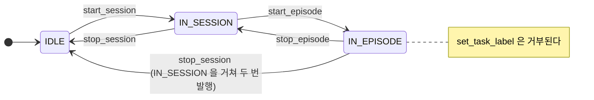

# 세션 제어 — `session_control_node` 와 `SessionControlClient` 가이드

세션(session)과 에피소드(episode)의 생명주기를 **한 노드가** 상태 머신으로 관리하고, 그 상태를
`/session` 토픽 하나로 알린다. 이 문서는 그 노드를 **쓰는 쪽** 전부를 다룬다 — CLI 로 부르는
사람, 다른 언어로 서비스를 부르는 노드, 그리고 Python 에서 `SessionControlClient` 를 쓰는 코드.

> 2026-09-06 에 `session_control_guide.md` 와 `session_control_client_guide.md` 를 하나로
> 합쳤다. 서버와 그 유일한 Python 클라이언트를 따로 두니 서비스 표·상태 전이·오류 메시지·
> namespace 설명이 두 벌이 되어 서로 갈라졌기 때문이다.

소스: [session_control_node.py](../../src/rdfp/rdfp/session/session_control_node.py) ·
[session_control_client.py](../../src/rdfp/rdfp/session/session_control_client.py) ·
IDL [rdfp_msgs](../../src/rdfp_msgs/)

---

## 목차

1. [개요](#1-개요)
2. [상태 머신](#2-상태-머신)
3. [계약 — 서비스 · 메시지 · QoS](#3-계약--서비스--메시지--qos)
4. [운용 — 빌드 · 기동 · namespace](#4-운용--빌드--기동--namespace)
5. [CLI 로 쓰기](#5-cli-로-쓰기)
6. [Python — `SessionControlClient`](#6-python--sessioncontrolclient)
7. [토픽 구독자 만들기](#7-토픽-구독자-만들기)
8. [오류 처리](#8-오류-처리)
9. [범위 밖 · 한계](#9-범위-밖--한계)
10. [트러블슈팅](#10-트러블슈팅)
11. [관련 문서](#11-관련-문서)

---

## 1. 개요

| | |
|---|---|
| 노드 | `session_control` (`ros2 run rdfp session_control_node`) |
| 입력 | 서비스 6종 — 상태를 바꾸는 5개 + 조회 1개 (§3.1). 경로는 **`/session_control/<name>`** |
| 출력 | `/session` 토픽 (`rdfp_msgs/msg/SessionCommand`, `TRANSIENT_LOCAL`) |
| Python 클라이언트 | `rdfp.session.SessionControlClient` — 상태를 바꾸는 5개를 동기/비동기로 래핑 (§6) |
| 소속 | 수집 계층 (`rdfp`). 제어 스택만 띄우면 **없다** — 클라이언트는 그 경우를 견뎌야 한다 (§6.4) |

**쓰는 이유**는 하나다. 여러 노드(레코더·카메라·트윈·후처리기)가 **같은 에피소드 경계**를
봐야 하는데, 각자 판단하면 갈라진다. 이 노드가 유일한 출처이고 `TRANSIENT_LOCAL` 이라 늦게
뜬 노드도 현재 상태를 바로 받는다.

**진입점이 둘이다.** 서비스를 직접 부르거나(CLI·다른 언어·§5), Python 이면
`SessionControlClient` 를 쓴다(§6). 두 길의 서버 쪽 동작은 같으므로 계약(§2·§3)은 한 번만
적는다.

---

## 2. 상태 머신

| 상태 | 뜻 |
|---|---|
| `IDLE` | 세션 없음. 기동 직후의 상태 |
| `IN_SESSION` | 세션 진행 중, 에피소드는 아님 |
| `IN_EPISODE` | 에피소드 진행 중 — 레코더가 녹화하고 후처리기가 자르는 구간 |



### 2.1 서비스별 허용 상태

| 서비스 | 허용 상태 | 발행되는 `/session` | 비고 |
|---|---|---|---|
| `start_session` | `IDLE` | `(IN_SESSION, <L>)` | |
| `start_episode` | `IN_SESSION` | `(IN_EPISODE, <L>)` | |
| `stop_episode` | `IN_EPISODE` | `(IN_SESSION, <L>, outcome, metadata)` | 성패·부가정보는 **이 전이에만** 실린다 |
| `stop_session` | `IN_SESSION` | `(IDLE, <L>)` | |
| `stop_session` | `IN_EPISODE` | `(IN_SESSION, <L>)` → `(IDLE, <L>)` | 한 호출로 2단계. **depth 1 구독자는 앞의 것을 놓친다** (§3.3) |
| `set_task_label` | `IDLE`, `IN_SESSION` | `(<state>, <NEW>)` | `IN_EPISODE` 에서는 **거부** — 진행 중인 에피소드의 라벨이 바뀌면 안 된다 |
| `get_session_state` | 전부 | (발행 없음) | 조회 |

`<L>` 은 현재 `task_label`. 허용되지 않은 상태에서 부르면 `success=false`,
`message='invalid command'` 이고 상태도 토픽도 변하지 않는다. 노드는 **발행한 뒤** 내부
상태를 바꾸므로, 토픽을 받은 시점에 서버는 이미 그 상태다.

### 2.2 라벨은 에피소드 전에 정한다

`set_task_label` 이 `IN_EPISODE` 에서 거부되는 것은 안전장치이지만, **빈 라벨로 시작한
에피소드는 나중에 고칠 수 없다** — bag 안의 `/session` 메시지가 이미 비어 있어 재import 로도
채워지지 않는다. 트윈의 `start_session` 이 라벨을 인자로 받아 먼저 `set_task_label` 을
부르는 이유다.

---

## 3. 계약 — 서비스 · 메시지 · QoS

### 3.1 서비스 6종

서버는 `~/` 로 열므로 실제 경로는 **`/session_control/<name>`** 이다 (§4.3 의 namespace 를
주면 `/<ns>/session_control/<name>`).

| 서비스 | 타입 | 요청 | 응답 |
|---|---|---|---|
| `start_session` | `std_srvs/srv/Trigger` | 없음 | `success`, `message` |
| `stop_session` | `std_srvs/srv/Trigger` | 없음 | `success`, `message` |
| `start_episode` | `std_srvs/srv/Trigger` | 없음 | `success`, `message` |
| `stop_episode` | **`rdfp_msgs/srv/StopEpisode`** | `outcome`, `metadata` (둘 다 생략 가능) | `success`, `message` |
| `set_task_label` | `rdfp_msgs/srv/SetString` | `task_label` (`''` 이면 clear) | `success`, `message` |
| `get_session_state` | `rdfp_msgs/srv/GetSessionState` | 없음 | `state`, `task_label` |

**`stop_episode` 만 `Trigger` 가 아니다.** 종료 시점에만 알 수 있는 성패와 부가정보를 받아
`/session` 메시지에 실어야 rosbag 에 남고, 후처리기가 `sessions` 테이블의 `success` /
`metadata` 로 옮긴다. 서비스 응답으로만 주고받으면 데이터셋에 남지 않는다.

| 필드 | 값 | 뜻 |
|---|---|---|
| `outcome` | `''` · `'success'` · `'failure'` | **`''` 는 실패가 아니라 '판정 없음'** 이며 DB 에 NULL 로 들어간다. 판정 주체가 없는 teleop 은 비운 채 부른다. bool 을 쓰지 않은 이유가 이것이다 — ROS bool 에는 '모름'이 없다 |
| `metadata` | JSON **object** 문자열 또는 `''` | seed·scene·초기 배치·실패 사유 등. DB 의 jsonb 컬럼에 그대로 들어가므로 최상위가 `{...}` 여야 한다. 배열·스칼라는 거부된다 |

`success` 는 **명령 수용 여부**이지 작업의 성패가 아니다. 성패는 요청의 `outcome` 이다.

`set_task_label` 의 `task_label` 은 영숫자와 `_` 를 가정하지만 **서버가 검증하지는
않는다.** 빈 문자열은 clear 다.

### 3.2 `/session` 메시지 — `rdfp_msgs/msg/SessionCommand`

```
std_msgs/Header header   # stamp = 발행 시각, frame_id = ''
string state             # 'IDLE' | 'IN_SESSION' | 'IN_EPISODE'  (전이 후의 상태)
string task_label        # 전이 후의 라벨 ('' 가능)
string outcome           # stop_episode 전이에서만 채워진다. 그 외 ''
string metadata          # stop_episode 전이에서만 채워진다. 그 외 ''
```

`outcome`/`metadata` 를 별도 토픽으로 빼지 않은 이유는 후처리기의 에피소드 감지기가 이
토픽 하나만 읽기 때문이다. 나누면 두 스트림을 stamp 로 맞추면서 순서·유실까지 다뤄야 한다.
노드는 기동 직후 `(IDLE, '')` 을 한 번 발행해 둔다.

### 3.3 QoS — `TRANSIENT_LOCAL` 이고, depth 1 의 함정이 있다

| 항목 | 값 |
|---|---|
| reliability | `RELIABLE` |
| durability | `TRANSIENT_LOCAL` |
| history depth | `1` (`robot_control.ros2_utils.SYSTEM_QOS`) |

구독자는 durability 를 **맞춰야** 한다. `VOLATILE` 로 구독하면 매칭 자체가 안 되어 값이 영영
오지 않는다. `ros2 topic echo` 도 플래그가 필요하다 (§5).

> ⚠️ **depth 1 로 구독하면 2단계 전이의 첫 메시지를 놓친다.** `IN_EPISODE` 에서
> `stop_session` 을 부르면 노드는 `IN_SESSION`, `IDLE` 을 연달아 발행하는데, 노드가 권하는
> `SYSTEM_QOS`(depth 1) 로 구독한 쪽은 **`IDLE` 만 받는다**. 실측(2026-09-06): depth 1 은
> `['IN_EPISODE', 'IDLE']`, depth 10 은 `['IN_EPISODE', 'IN_SESSION', 'IDLE']`.
>
> 그래서 **구독자는 `IDLE` 도 에피소드 종료로 처리해야 한다.** 레코더·카메라 노드·후처리기가
> 그렇게 되어 있다 ([rdfp_image_recorder_node.py](../../src/rdfp/rdfp/recorder/rdfp_image_recorder_node.py)
> `_on_session`, 후처리기 설계서 §7.4). "두 메시지를 받아 에피소드 후처리와 세션 후처리를
> 나눈다"는 설계는 depth 를 올리지 않는 한 성립하지 않는다.

---

## 4. 운용 — 빌드 · 기동 · namespace

### 4.1 빌드

노드가 `robot_control.ros2_utils` 를 import 하므로 세 패키지가 필요하다.

```bash
colcon build --packages-select rdfp_msgs robot_control rdfp
source install/setup.bash
```

### 4.2 기동과 확인

```bash
ros2 run rdfp session_control_node          # 단독
ros2 launch rdfp rdfp.launch.py             # 수집 launch 는 전부 이 노드를 포함한다

ros2 node list | grep session_control
ros2 service list | grep session_control    # /session_control/start_session ...
ros2 topic list | grep -E '^/session$'      # 토픽은 루트다
```

기동 직후 상태는 `IDLE`, `task_label=''` 이며 **재시작하면 항상 여기서 시작한다.** 이전
상태를 저장하지 않는다.

### 4.3 로봇이 둘 이상이어도 세션은 **하나다**

**세션 노드를 로봇별로 띄우지 않는다.** 로봇이 둘 이상이라는 것은 **공동 작업으로 하나의
학습 데이터를 만든다**는 뜻이지 각자 수집한다는 뜻이 아니다. 서로 다른 학습 작업은
**`ROS_DOMAIN_ID` 를 나눠서** 한다.

나누면 무엇이 깨지는지가 이 결정의 근거다 — 한쪽 조작자의 `stop_episode` 가 다른 쪽
에피소드를 자르고, 에피소드 경계가 로봇마다 갈려 **공동 작업이 하나의 시연으로 안
묶인다.** 그래서 `session` 은 `/clock` 과 같은 부류의 전역 채널이다
([topic_naming_contract.md](../topic_naming_contract.md) §2.5).

> **그래서 세션 채널은 코드에 절대 이름으로 적혀 있다** — 토픽 `/session` 과 서비스
> `/session_control/*` 둘 다. 발행자·소비자(카메라·레코더·뷰어)와
> `SessionControlClient` 의 기본 namespace 가 모두 그렇다. 상대로 되돌리면 그 노드가
> 로봇별 네임스페이스 안에 들어갔을 때 `/abc/session` 을 찾아 **조용히 아무것도 못
> 받는다** — 증상이 "녹화가 시작되지 않는다" 하나뿐이라 회귀 테스트로 막아 두었다.

---

## 5. CLI 로 쓰기

```bash
# 라벨은 에피소드 전에 (§2.2)
ros2 service call /session_control/set_task_label rdfp_msgs/srv/SetString \
  "{task_label: 'pick_and_place'}"

ros2 service call /session_control/start_session std_srvs/srv/Trigger "{}"
ros2 service call /session_control/start_episode std_srvs/srv/Trigger "{}"
# ... 조작 ...

# 종료 — 성패·부가정보는 생략해도 된다 (판정 없음)
ros2 service call /session_control/stop_episode rdfp_msgs/srv/StopEpisode "{}"
ros2 service call /session_control/stop_episode rdfp_msgs/srv/StopEpisode \
  "{outcome: 'success', metadata: '{\"seed\": 7}'}"

ros2 service call /session_control/stop_session std_srvs/srv/Trigger "{}"

# 라벨 clear
ros2 service call /session_control/set_task_label rdfp_msgs/srv/SetString "{task_label: ''}"

# 조회
ros2 service call /session_control/get_session_state rdfp_msgs/srv/GetSessionState "{}"

# 토픽 — QoS 플래그 필수. 데몬이 꼬여 있으면 --no-daemon
ros2 topic echo /session rdfp_msgs/msg/SessionCommand \
  --qos-durability transient_local --qos-reliability reliable
```

거부 응답의 예:

```
success=False, message='invalid command'                                   # 상태 위반
success=False, message="outcome must be one of ['', 'failure', 'success'], got 'bogus'"
success=False, message='metadata must be a JSON object string'
```

---

## 6. Python — `SessionControlClient`

```python
from rdfp.session import SessionControlClient
```

**패키지 경로가 공개 API 다.** 모듈 경로(`rdfp.session.session_control_client`)로도
되지만, 호출자(teleop · 트윈)는 전부 위 경로를 쓴다 — 클래스를 다른 모듈로 옮겨도
호출부가 안 깨지게 하기 위해서다. 노드(`session_control_node`)는 진입점으로만 쓰이므로
패키지에서 재노출하지 않는다.

호출자의 `rclpy.Node` 를 주입받아 그 위에 서비스 클라이언트를 만드는 **유틸리티**다. 자체
노드가 아니다. `ServoClient` 와 같은 패턴이라 이미 있는 노드에 한 줄로 붙는다.

### 6.1 생성

```python
client = SessionControlClient.create(node, namespace='session_control', wait_timeout_sec=10.0)
```

| 인자 | 뜻 |
|---|---|
| `node` | 클라이언트를 붙일 노드. 필수 |
| `namespace` | 서버 노드 이름(서비스 prefix). 기본 `'session_control'` 이고 **보통 그대로 둔다** — 세션 서버는 시스템에 하나다(§4.3). 서버를 다른 이름·namespace 로 띄운 경우에만 `'/other/session_control'` 처럼 **절대 경로**로 준다 |
| `wait_timeout_sec` | 서비스 5개가 모두 뜰 때까지 기다리는 **총** 예산. 넘기면 `RuntimeError` (어느 서비스인지 메시지에 있다). **`0` 이하이면 기다리지 않는다** |

예산은 서비스마다 **남은 시간 전체**를 주므로, 앞의 것이 오래 걸리면 뒤의 것에 남는 시간이
줄어든다. 넉넉히 잡는다.

래핑하는 것은 **상태를 바꾸는 5개**뿐이다. `get_session_state` 는 래핑하지 않는다 — 현재
상태는 `/session` 토픽으로 읽는 것이 정본이라 호출처가 없었다 (§6.5).

### 6.2 동기 API — 스크립트와 spin 전 초기화용

```python
client.start_session(timeout_sec=5.0)                       -> (bool, str)
client.stop_session(timeout_sec=5.0)                        -> (bool, str)
client.start_episode(timeout_sec=5.0)                       -> (bool, str)
client.stop_episode(outcome='', metadata='', timeout_sec=5.0) -> (bool, str)
client.set_task_label(task_label, timeout_sec=5.0)          -> (bool, str)   # None 은 clear
```

`(success, message)` 를 돌려준다. `success` 는 명령 수용 여부다 (§3.1). `message` 는 §8 의
표준 문자열 중 하나이며 **분기는 `success` 로** 한다.

**`timeout_sec` 이 0 이하이면 무한 대기다.** 그리고 **타임아웃은 취소가 아니다** — 응답만
못 받았을 뿐 서버는 명령을 처리했을 수 있다. 실측으로 `timeout_sec=0.0` 을 그대로 rclpy 에
넘기던 시절에는 즉시 `service call timed out` 을 돌려주면서 상태는 바뀌어 있었다. 그래서
지금은 0 이하를 `None`(무한) 으로 바꿔 넘긴다.

**동기 API 는 노드가 외부 executor 에서 spin 중이 아닐 때만 쓴다.** 내부에서
`rclpy.spin_until_future_complete(node, ...)` 를 부르므로, 이미 spin 중인 노드나 콜백 안에서
부르면 데드락이다.

```python
def main() -> None:
    rclpy.init()
    node = Node('session_script')
    try:
        client = SessionControlClient.create(node, wait_timeout_sec=10.0)
        client.set_task_label('pick_and_place')
        client.start_session()
        client.start_episode()
        # ... 실험 ...
        ok, msg = client.stop_episode(outcome='success', metadata='{"seed": 7}')
        client.stop_session()
    finally:
        node.destroy_node()
        rclpy.shutdown()
```

### 6.3 비동기 API — 타이머·콜백·다른 스레드용

```python
client.start_session_async(done_callback=None)                          -> Future
client.stop_session_async(done_callback=None)                           -> Future
client.start_episode_async(done_callback=None)                          -> Future
client.stop_episode_async(outcome='', metadata='', done_callback=None)  -> Future
client.set_task_label_async(task_label, done_callback=None)             -> Future
```

- `done_callback` 은 `(success: bool, message: str)` 로 불린다. `None` 이면 raw
  `rclpy.task.Future` 만 돌려주므로 `result()` 로 원본 응답을 볼 수 있다.
- **서버가 없으면 즉시 `(False, 'service not ready')` 로 콜백이 오고, 완료된(결과 `None`)
  future 를 돌려준다.** `call_async` 는 미준비 서비스에도 future 를 주는데 그것이 영영
  완료되지 않아 콜백이 불리지 않기 때문이다 — 다섯 메서드가 **전부** 이 검사를 한다
  (한때 `set_task_label_async` 만 빠져 있었다).
- 호출이 예외로 끝나면 `(False, 'exception: ...')`, 응답이 `None` 이면 `(False, 'no response')`.
- `stop_episode_async` 의 `done_callback` 은 세 번째 인자다. **키워드로 넘긴다.**

```python
class MyNode(Node):
    def __init__(self) -> None:
        super().__init__('my_node')
        self.session = SessionControlClient.create(self, wait_timeout_sec=15.0)
        self.create_timer(1.0, self._on_tick)

    def _on_tick(self) -> None:
        self.session.start_session_async(done_callback=self._on_started)   # 콜백 안은 비동기만

    def _on_started(self, success: bool, message: str) -> None:
        if not success:
            self.get_logger().warning(f'session start failed: {message}')
```

`MultiThreadedExecutor` 에서는 `done_callback` 이 executor 스레드 중 하나에서 불린다. 콜백이
만지는 사용자 상태의 보호는 호출자 몫이다.

### 6.4 서버가 없어도 살아야 하는 호출자 — `wait_until_ready`

`session_control_node` 는 수집 계층이라 제어 스택만 띄우면 없다. 그래도 계속 동작해야 하는
노드(`teleop_keyboard`)는 생성 시 대기를 끄고 예외 없이 확인한다.

```python
self.session = SessionControlClient.create(self, wait_timeout_sec=0.0)
self.session_available = self.session.wait_until_ready(2.0)     # True / False, 예외 없음
if not self.session_available:
    self.get_logger().warning('session_control services not found — session keys disabled')
```

`is_ready()` 는 대기 없이 현재 상태만 본다. 서버가 재기동되면 rclpy 클라이언트가 스스로
다시 붙고 `is_ready()` 도 다시 `True` 가 된다. 재기동 직후에는 잠깐 `False` 일 수 있으니
호출 실패 시 재시도는 호출자가 한다.

### 6.5 현재 상태는 토픽으로 읽는다

클라이언트는 상태를 캐시하지 않는다. 필요하면 호출자 노드가 `/session` 을 `SYSTEM_QOS` 로
구독한다 (§7). `TRANSIENT_LOCAL` 이라 붙는 순간 현재 상태가 온다. 서비스 조회
(`get_session_state`) 는 CLI 진단용으로 남겨 두었고 클라이언트에는 래퍼가 없다.

### 6.6 언제 어느 API 인가

| 상황 | API |
|---|---|
| 스크립트·REPL·테스트 (노드를 직접 spin 하지 않음) | 동기 |
| `main()` 에서 executor 를 돌리기 **전** 의 초기 설정 | 동기 |
| 타이머·구독·서비스 콜백 안 | **비동기** |
| 별도 스레드, 트윈처럼 executor 가 다른 스레드에서 도는 곳 | **비동기** (future 를 직접 기다린다) |

---

## 7. 토픽 구독자 만들기

```python
from rdfp_msgs.msg import SessionCommand
from robot_control.ros2_utils import SYSTEM_QOS      # RELIABLE / TRANSIENT_LOCAL / depth 1


class SessionSubscriber(Node):
    def __init__(self) -> None:
        super().__init__('session_subscriber')
        self._prev = 'IDLE'
        self.create_subscription(SessionCommand, 'session', self._on_msg, SYSTEM_QOS)

    def _on_msg(self, msg: SessionCommand) -> None:
        if msg.state == 'IN_EPISODE' and self._prev != 'IN_EPISODE':
            self._start_recording(msg)
        elif self._prev == 'IN_EPISODE' and msg.state in ('IN_SESSION', 'IDLE'):
            # IDLE 도 종료다 — depth 1 이면 중간 IN_SESSION 이 안 온다 (§3.3)
            self._stop_recording(msg)              # msg.outcome / msg.metadata 는 여기서만 유효
        self._prev = msg.state
```

토픽 이름은 `session` 을 **루트 상대**로 둔다. 그래야 namespace(§4.3) 가 붙었을 때 서버와
같이 옮겨간다. `~/session` 으로 두면 노드 이름이 붙어 어긋난다.

---

## 8. 오류 처리

| `success` | `message` | 뜻 | 어디서 |
|---|---|---|---|
| `false` | `invalid command` | 현재 상태에서 허용되지 않는 서비스 (§2.1) | 서버 |
| `false` | `outcome must be one of [...]` | `stop_episode` 의 `outcome` 이 세 값 밖 | 서버 |
| `false` | `metadata must be a JSON object string` | `stop_episode` 의 `metadata` 가 object 가 아님 | 서버 |
| `false` | `service not ready` | 호출 직전 `service_is_ready()` 가 거짓 — 서버 없음·재기동 중 | 클라이언트 (동기·비동기) |
| `false` | `service call timed out` | `timeout_sec` 안에 응답 없음. **명령은 처리됐을 수 있다** | 클라이언트 (동기) |
| `false` | `no response` | future 는 끝났는데 결과가 `None` | 클라이언트 |
| `false` | `exception: <str>` | 호출이 예외로 끝남 | 클라이언트 |

서버가 거부하면 상태·라벨·토픽 모두 그대로이고 로그에 `warning` 이 남는다.

```
[WARN] [session_control]: invalid command 'stop_session' in state IDLE
[WARN] [session_control]: stop_episode rejected: metadata must be a JSON object string
```

클라이언트가 예외를 던지는 곳은 **생성자의 대기 타임아웃**(`RuntimeError`) 하나뿐이다.
launch 순서 문제를 빨리 드러내기 위한 것이며, 견뎌야 하는 호출자는 §6.4 의 경로를 쓴다.

---

## 9. 범위 밖 · 한계

- 실제 기록(레코더·rosbag)은 이 노드의 일이 아니다. 이 노드는 **경계만** 선언한다.
- 명령 이력·큐잉·권한·다중 세션·lifecycle 인터페이스·재시작 후 상태 복원은 없다.
- 단일 스레드 executor 라 서비스 콜백은 순차 처리된다. 다만 "조회 → 명령" 사이에 다른
  클라이언트가 끼어들 수 있으므로, 그 race 가 문제면 상위에서 조율한다.
- 클라이언트는 연결 상태를 추적하지 않고 상태도 캐시하지 않는다 (§6.4, §6.5).
- 노드 상태 머신에는 단위 테스트가 없다. 클라이언트는
  [teleop/tests/test_session_optional.py](../../src/rdfp/rdfp/teleop/tests/test_session_optional.py)
  와 트윈의 [test_session_operations.py](../../src/robot_twin/robot_twin/tests/test_session_operations.py)
  (stub) 로 덮인다.

---

## 10. 트러블슈팅

### `ros2 service call /start_session` 이 응답 없이 멈춘다

경로가 틀렸다. 서비스는 `/session_control/start_session` 이다 (§3.1). `ros2 service list |
grep session_control` 로 본다. 토픽만 루트 `/session` 이다.

### 구독자가 `/session` 을 한 번도 못 받는다

`VOLATILE` 로 구독했다. `TRANSIENT_LOCAL` + `RELIABLE` 이어야 매칭된다 (§3.3). `ros2 topic
echo` 도 두 플래그가 필요하다. 그래도 안 오면 `ros2 daemon stop` 뒤 다시 하거나
`--no-daemon` 을 붙인다.

### `stop_session` 뒤 레코더가 에피소드를 못 닫는다

`IN_SESSION` 만 종료로 보고 있다. depth 1 구독자에게는 `IDLE` 만 온다 (§3.3). `IDLE` 도 종료로
처리한다.

### `RuntimeError: SessionControlClient: service '...' not available within N.Ns`

생성 시점에 서버가 없거나 namespace 가 다르다. 서버를 먼저 띄우거나 `wait_timeout_sec` 를
늘리거나, 서버가 없어도 되는 호출자면 `wait_timeout_sec=0.0` + `wait_until_ready()` 로 바꾼다
(§6.4).

### 동기 호출이 멈추거나 항상 타임아웃한다

노드가 이미 executor 에서 spin 중인데 동기 API 를 불렀다. `*_async` 로 바꾼다 (§6.3).

### 비동기 콜백이 영영 안 온다

클라이언트 생성 뒤 서버가 내려갔고, `is_ready()` 를 안 봤다면 콜백은 즉시
`(False, 'service not ready')` 로 와야 한다. 그렇지 않다면 `done_callback` 을 위치 인자로
넘겨 `stop_episode_async` 의 `outcome` 자리에 들어간 경우다 — 키워드로 넘긴다.

### `set_task_label` 이 계속 거부된다

`IN_EPISODE` 다. 설계 의도이며 `stop_episode` 뒤에 부른다 (§2.2).

### 에피소드에 라벨이 비어 있다

`start_episode` 전에 `set_task_label` 을 안 불렀다. 기록이 끝난 뒤에는 고칠 수 없다 (§2.2).

---

## 11. 관련 문서

- [session_control_node.py](../../src/rdfp/rdfp/session/session_control_node.py) · [session_control_client.py](../../src/rdfp/rdfp/session/session_control_client.py)
- [../../src/rdfp_msgs/](../../src/rdfp_msgs/) — `SessionCommand.msg`, `StopEpisode.srv`, `SetString.srv`, `GetSessionState.srv`
- [../recorder/rdfp_image_recorder_node_guide.md](../recorder/rdfp_image_recorder_node_guide.md) — `/session` 을 따라 자동 분절하는 레코더
- [../camera/rdfp_camera_node_guide.md](../camera/rdfp_camera_node_guide.md) — 세션에 맞춰 켜고 끄는 카메라
- [../rosbag2/데이터셋 후처리기 설계서.md](../rosbag2/데이터셋%20후처리기%20설계서.md) — `/session` 으로 에피소드를 자르는 규칙과 `outcome`/`metadata` 의 적재
- [../robot_twin/robot_twin_design.md](../robot_twin/robot_twin_design.md) — 트윈이 이 클라이언트를 쓰는 방식 (`robot_twin.backends` 엔트리포인트)
- [../moveit/servo_client_programmers_guide.md](../moveit/servo_client_programmers_guide.md) — 같은 Node 주입 패턴의 `ServoClient`
